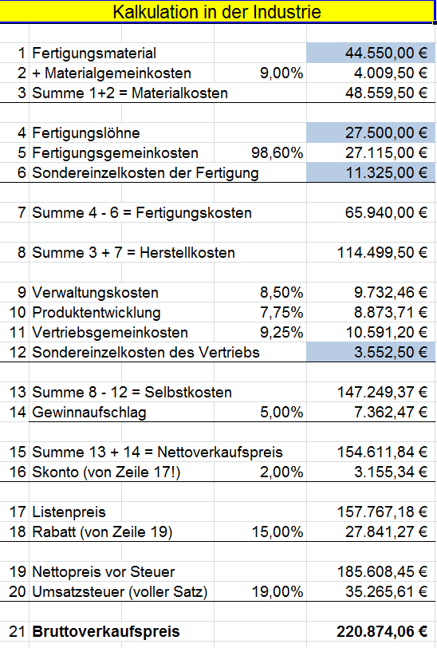

# Aufgaben

## 8.6

### 1

Der Satz des Pythagoras lautet `a² + b² = c²`. Erstellen Sie ein Programm zur Berechnung der Seite C nach Eingabe der Werte für a und b. Für die Wurzelberechnung können Sie die Funktion `sqrt()` benutzen.


```cpp
#include <iostream>
#include <cmath>

using namespace std;

int main(int argc, char const *argv[])
{
  float a = 0;
  float b = 0;
  float c = 0;

  cout << "Bitte Seite a eingeben: " << endl;
  cin >> a;

  do
  {
    cout << "Bitte positive Werte fuer Seite a eingeben: " << endl;
    cin >> a;
  } while (a < 0);

  cout << "Bitte Seite b eingeben: " << endl;
  cin >> b;

  do
  {
    cout << "Bitte positive Werte fuer Seite b eingeben: " << endl;
    cin >> b;
  } while (b < 0);

  c = sqrt(a * a + b * b);

  cout << "Fuer a = " << a << " und b = " << b << endl;
  cout << "Betraegt c = " << c << endl;

  return 0;
}
```

### 2

Früher wurde das Normalgewicht berechnet aus der Körpergröße in Zentimetern - 100, das dazugehörige Idealgewicht lag bei Männern 10% darunter, bei Frauen minus 15%.

Erstellen Sie ein Programm, das Größe und Geschlecht (`m`/`w`) abfragt und dann Normal- und Ideal-gewicht ausgibt.

Erweiterung: Lassen Sie das tatsächliche Gewicht eingeben und geben Sie die Abweichung vom Normal- und Idealgewicht aus, ggf. mit entsprechenden Bewertung "Sie haben Über-/Untergewicht."

```cpp
#include <iostream>

using namespace std;

int main(int argc, char const *argv[])
{
  float groesse = 0;
  char geschlecht = ' ';
  float idealGewicht = 0;
  float normalGewicht = 0;
  float gewicht = 0;

  cout << "Bitte Koerpergroesse in cm eingeben: " << endl;
  cin >> groesse;

  do
  {
    cout << "Bitte geben Sie Ihr Geschlecht an (w/m) : " << endl;
    cin >> geschlecht;
  } while (geschlecht != 'w' && geschlecht != 'm');

  cout << "Bitte geben Sie Ihr Gewicht ein: " << endl;
  cin >> gewicht;

  normalGewicht = groesse - 100;

  if (geschlecht == 'w')
  {
    idealGewicht = normalGewicht * 0.85;
  }
  else
  {
    idealGewicht = normalGewicht * 0.9;
  }

  cout << "Ihr Normalgewicht betraegt : " << normalGewicht << endl;
  cout << "Ihr Idealgewicht betraegt : " << idealGewicht << endl;
  if (gewicht < idealGewicht)
  {
    cout << "Sie haben Untergewicht!" << endl;
  }
  else
  {
    cout << "Sie haben Uebergewicht!" << endl;
  }

  return 0;
}
```

### 3

Eingabe: Stückzahl und Einzelpreis.

Bei mehr als 10 Stück gibt es 5 % Rabatt, bei mehr als 50 Stück gibt es 10 % Rabatt.

Ausgabe: Gesamtpreis.

```cpp
#include <iostream>


using namespace std;

int main(int argc, char const *argv[])
{
  int menge = 0;
  float einzelPreis = 0;
  float gesamtPreis = 0;
  int rabatt1 = 5;
  int rabatt2 = 10;

  cout << "Bitte geben Sie die Stueckzahl ein: " << endl;
  cin >> menge;

  cout << "Bitte geben Sie den Einzelpreis an: " << endl;
  cin >> einzelPreis;

  if (menge > 50)
  {
    gesamtPreis = menge * (einzelPreis + (einzelPreis * rabatt1 / 100));
  }
  else if (menge > 10)
  {
    gesamtPreis = menge * (einzelPreis + (einzelPreis * rabatt2 / 100));
  }
  else
  {
    gesamtPreis = menge * einzelPreis;
  }

  cout << "Der Gesamtpreis betraegt: " << gesamtPreis << endl;

  return 0;
}
```

### 4

Schreiben Sie ein Programm, welches eine Note (1 bis 6) in Ziffern einliest und anschließend die Note in Worten (’sehr gut’, ’gut’ usw.) ausgibt. Wenn eine ungültige Ziffer (>6 oder <1) eingegeben wurde, erscheint eine Fehlermeldung.

```cpp
#include <iostream>

using namespace std;

int main(int argc, char const *argv[])
{
  int note = 0;

  cout << "Bitte Note eingeben: " << endl;
  cin >> note;

  while (note < 0 || note > 6)
  {
    cout << "Bitte geben Sie eine Note zwischen 1-6 an: " << endl;
    cin >> note;
  }

  switch (note)
  {
  case 1:
    cout << "Ihr Note ist sehr gut! " << endl;
    break;
  case 2:
    cout << "Ihr Note ist gut! " << endl;
    break;
  case 3:
    cout << "Ihr Note ist befriedigend! " << endl;
    break;
  case 4:
    cout << "Ihr Note ist ausreichend! " << endl;
    break;
  case 5:
    cout << "Ihr Note ist mangelhaft! " << endl;
    break;
  default:
    cout << "Ihr Note ist ungenuegend! " << endl;
    break;
  }

  return 0;
}
```

### 5

Für einen einfachen Taschenrechner soll es 3 (drei!) einzelne Eingaben geben:

- Zahl1
- Operator `+`, `-`, `*`, `/`
- Zahl2

Das Programm soll dann anhand des Operators die richtige Berechnung durchführen und das Ergebnis auf dem Bildschirm ausgeben.

Achtung: Eine Division durch `0` ist nicht erlaubt und ist mit einer Fehlermeldung zu quittieren, es darf dann kein Ergebnis ausgegeben werden.

```cpp
#include <iostream>

using namespace std;

int main(int argc, char const *argv[])
{
  float zahl1 = 0.0;
  float zahl2 = 0.0;
  char operat = ' ';
  float ergebnis = 0.0;

  cout << "Bitte Zahl1 eingeben: " << endl;
  cin >> zahl1;

  do
  {
    cout << "Bitte Operator eingeben: " << endl;
    cin >> operat;
  } while (operat != '+' && operat != '-' && operat != '*' && operat != '/');

  do
  {
    cout << "Bitte Zahl2 eingeben: " << endl;
    cin >> zahl2;
    if (operat == '/' && zahl2 == 0)
    {
      cout << "Division durch 0 nicht moeglich!" << endl;
    }
  } while (operat == '/' && zahl2 == 0);

  switch (operat)
  {
  case '+':
    ergebnis = zahl1 + zahl2;
    cout << zahl1 << " + " << zahl2 << " = " << ergebnis << endl;
    break;
  case '-':
    ergebnis = zahl1 - zahl2;
    cout << zahl1 << " - " << zahl2 << " = " << ergebnis << endl;
    break;
  case '*':
    ergebnis = zahl1 * zahl2;
    cout << zahl1 << " * " << zahl2 << " = " << ergebnis << endl;
    break;
  default:
    ergebnis = zahl1 / zahl2;
    cout << zahl1 << " / " << zahl2 << " = " << ergebnis << endl;
    break;
  }

  return 0;
}
```

### 6

Es werden 3 Zahlen per Tastatur eingeben, der Computer gibt anschließend die größte Zahl wieder aus.

Erweiterung: Auch die kleinste eingegebene Zahl wird ausgegeben.

```cpp
#include <iostream>

using namespace std;

int main(int argc, char const *argv[])
{
  float eingabe = 0;
  float min = 0;
  float max = 0;

  for (int i = 1; i <= 3; i++)
  {
    cout << "Bitte Zahl" << i << " eingeben:" << endl;
    cin >> eingabe;

    if (i == 1)
    {
      max = min = eingabe;
    }
    else if (eingabe < min)
    {
      min = eingabe;
    }
    else if (eingabe > max)
    {
      max = eingabe;
    }
  }

  cout << "Die kleinste Zahl betrug: " << min << endl;
  cout << "Die groesste Zahl betrug: " << max << endl;

  return 0;
}
```

### 7

Ein Unternehmen beschließt für seine Mitarbeiter Belegschaftsaktien zu Vorzugskonditionen anzubieten.
Es werden folgende Konditionen festgesetzt.

Mitarbeiter mit einer Betriebszugehörigkeit von mehr als 10 Jahren können 20 Aktien beziehen,
bei einer Betriebszugehörigkeit von mehr als 2 Jahren können sie 10 Aktien erwerben.

Mitarbeiter, die sich in einem gekündigten Arbeitsverhältnis befinden, sollen jedoch keine Aktien erhalten.

Eingabe:
Dauer der Betriebszugehörigkeit, gekündigtes Arbeitsverhältnis (`ja` oder `nein`)

Ausgabe: Anzahl der Aktien, die bezogen werden können.

```cpp
#include <iostream>

using namespace std;

int main(int argc, char const *argv[])
{
  int betriebsZugehoerigkeit = 0;
  int aktien = 0;
  char gekuendigt = ' ';

  cout << "Bitte Dauer der Betriebszugehoerigkeit angeben: " << endl;
  cin >> betriebsZugehoerigkeit;

  do
  {
    cout << "Wurde Ihnen gekuendigt (j/n)?" << endl;
    cin >> gekuendigt;
    if (gekuendigt != 'j' && gekuendigt != 'n')
    {
      cout << "Falsche Eingabe! Bitte (j/n) angeben: " << endl;
    }

  } while (gekuendigt != 'j' && gekuendigt != 'n');

  if (gekuendigt == 'j')
  {
    cout << "Da Ihnen gekuendigt wurde erhalten Sie keine Vorzugsaktien" << endl;
  }
  else
  {
    if (betriebsZugehoerigkeit > 10)
    {
      aktien = 20;
      cout << "Sie koennen " << aktien << " Vorzugsaktien erwerben!" << endl;
    }
    else
    {
      aktien = 10;
      cout << "Sie koennen " << aktien << " Vorzugsaktien erwerben!" << endl;
    }
  }

  return 0;
}
```

### 8

Nach Eingabe eines Gehalts und eines Kennbuchstabens (`S`tunde, `W`oche, `M`onat) wird das entsprechende Jahresgehalt ausgerechnet.

Das Jahr hat 52 Wochen, 12 Monate und 2080 Arbeitsstunden/Jahr sind zu leisten.


alternativ:


```cpp
#include <iostream>

using namespace std;

int main(int argc, char const *argv[])
{
  float gehalt = 0;
  float jahresGehalt = 0;
  char kennBuchstabe = ' ';

  do
  {
    cout << "Bitte geben Sie Ihr Gehalt ein: " << endl;
    cin >> gehalt;
  } while (gehalt <= 0);

  do
  {
    cout << "Bitte geben Sie Berechnungzeitraum ein (S)tunden-, (W)ochen- oder (M)onatslohn : " << endl;
    cin >> kennBuchstabe;
  } while (kennBuchstabe != 's' && kennBuchstabe != 'S' && kennBuchstabe != 'w' && kennBuchstabe != 'W' && kennBuchstabe != 'm' && kennBuchstabe != 'M');

  if (kennBuchstabe == 's' || kennBuchstabe == 'S')
  {
    jahresGehalt = gehalt * 2080;
  }
  else if (kennBuchstabe == 'w' || kennBuchstabe == 'W')
  {
    jahresGehalt = gehalt * 52;
  }
  else
  {
    jahresGehalt = gehalt * 12;
  }

  cout << "Ihr Jahresgehalt betraegt: " << jahresGehalt << endl;

  return 0;
}
```

### 9

Erstellen Sie ein Programm für eine einfache Datumsprüfung. Es werden einzeln Tag, Monat, Jahr eingegeben und sind danach zu prüfen.

- Der Tag muss zwischen 1 und 31 liegen
- Der Monat dann zwischen 1 und 12 und
- Jahreszahl sollen nur zwischen 1800 und 2200 erlaubt sein.

Das Programm gibt am Ende aus: `Plausibles Datum!` oder `Falsches Datum!`

```cpp
#include <iostream>

using namespace std;

int main(int argc, char const *argv[])
{
  int tag = 0;
  int monat = 0;
  int jahr = 0;

  cout << "Bitte Tag eingeben" << endl;
  cin >> tag;
  cout << "Bitte Monat eingeben" << endl;
  cin >> monat;
  cout << "Bitte Jahr eingeben" << endl;
  cin >> jahr;

  if (tag < 1 || tag > 31 || monat < 1 || monat > 12 || jahr < 1800 || jahr > 2200)
  {
    cout << "Falsche Datumeingabe!" << endl;
  }
  else
  {
    cout << "Plausible Datumeingabe!" << endl;
  }

  return 0;
}
```

### 10

Verfeinern Sie Ihre Lösung: Januar, März, Mai, Juli, August, Oktober, Dezember haben 31 Tage, die anderen Monate mit Ausnahme des Februars haben 30 Tage.

-> Sie müssen also Tag und Monat im Zusammenhang prüfen…

Das Monatsende des Februars muss natürlich im Zusammenhang mit dem Jahr geprüft werden, gibt es 28 oder 29 Tage?!?

- 2020 Schaltjahr
- 1900 kein Schaltjahr

```cpp
#include <iostream>

using namespace std;

int main(int argc, char const *argv[])
{
  int tag = 0;
  int monat = 0;
  int jahr = 0;

  cout << "Bitte Tag eingeben" << endl;
  cin >> tag;
  cout << "Bitte Monat eingeben" << endl;
  cin >> monat;
  cout << "Bitte Jahr eingeben" << endl;
  cin >> jahr;

  if (tag < 1 || tag > 31 || monat < 1 || monat > 12 || jahr < 1800 || jahr > 2200)
  {

    cout << "Falsche Datumeingabe!" << endl;
  }
  else
  {
    cout << "Plausible Datumeingabe!" << endl;
  }
  if (monat == 1 || monat == 3 || monat == 5 || monat == 7 || monat == 8 || monat == 10 || monat == 12)
  {
    cout << "Dieser Monat hat 31 Tage" << endl;
    // cout << "Den " << tag << "." << monat << "." << jahr << " gibt es nicht!" << endl;
  }
  else if (monat == 2)
  {
    if (jahr % 400 == 0 || jahr % 4 == 0 && jahr % 100 != 0)
    {
      cout << "Schaltjahr: Dieser Monat hat 29 Tage" << endl;
      /* code */
    }
    else
    {
      cout << "Dieser Monat hat 28 Tage" << endl;
    }
  }
  else
  {
    cout << "Dieser Monat hat 30 Tage!" << endl;
  }

  return 0;
}
```

### 11

Es gelte folgende vereinfachte Steuertabelle:

- 20% Steuern bei mehr als 10.000€ Einkommen;
- 30% Steuern bei mehr als 25.000€ Einkommen;
- 50% Steuern bei mehr als 50.000€ Einkommen;
- Geringverdiener zahlen nur 10% Steuern.

Eingegeben wird (nur) das Bruttogehalt.
Erstellen Sie ein Programm zur Ermittlung und Ausgabe der Steuerlast und des Nettogehalts.


```cpp
#include <iostream>

using namespace std;

int main(int argc, char const *argv[])
{
  float bruttoGehalt = 0.0;
  float steuerLast = 0.0;
  float nettoGehalt = 0.0;

  cout << "Bitte Bruttogehalt eingeben: " << endl;
  cin >> bruttoGehalt;

  if (bruttoGehalt > 50000)
  {
    nettoGehalt = bruttoGehalt * 0.5;
  }
  else if (bruttoGehalt > 25000)
  {
    nettoGehalt = bruttoGehalt * 0.7;
  }
  else if (bruttoGehalt > 10000)
  {
    nettoGehalt = bruttoGehalt * 0.8;
  }
  else
  {
    nettoGehalt = bruttoGehalt * 0.9;
  }

  steuerLast = bruttoGehalt - nettoGehalt;

  cout << "Ihr Nettogehalt betraegt: " << nettoGehalt << endl;
  cout << "Ihre Steuerlast betraegt: " << steuerLast << endl;

  return 0;
}
```

## 12

Verknüpfen Sie die beiden vorherigen Aufgaben (8) zum „Jahres/Stunde/Monatsgehalt“ und
die Aufgabe (11) zur Steuerberechnung, so dass nach Ermittlung des Jahresgehalts (Brutto)
die Steuer und der Nettolohn ermittelt werden.

```cpp
#include <iostream>

using namespace std;

int main(int argc, char const *argv[])
{
  float bruttoGehalt = 0;
  float jahresGehaltBrutto = 0;
  float jahresGehaltNetto = 0;
  float steuerLast = 0;
  char kennBuchstabe = ' ';

  do
  {
    cout << "Bitte geben Sie Ihr Gehalt (brutto) ein: " << endl;
    cin >> bruttoGehalt;
  } while (bruttoGehalt <= 0);

  do
  {
    cout << "Bitte geben Sie Berechnungzeitraum ein (S)tunden-, (W)ochen- oder (M)onatslohn : " << endl;
    cin >> kennBuchstabe;
  } while (kennBuchstabe != 's' && kennBuchstabe != 'S' && kennBuchstabe != 'w' && kennBuchstabe != 'W' && kennBuchstabe != 'm' && kennBuchstabe != 'M');

  if (kennBuchstabe == 's' || kennBuchstabe == 'S')
  {
    jahresGehaltBrutto = bruttoGehalt * 2080;
  }
  else if (kennBuchstabe == 'w' || kennBuchstabe == 'W')
  {
    jahresGehaltBrutto = bruttoGehalt * 52;
  }
  else
  {
    jahresGehaltBrutto = bruttoGehalt * 12;
  }

  if (jahresGehaltBrutto > 50000)
  {
    jahresGehaltNetto = jahresGehaltBrutto * 0.5;
  }
  else if (jahresGehaltBrutto > 25000)
  {
    jahresGehaltNetto = jahresGehaltBrutto * 0.7;
  }
  else if (jahresGehaltBrutto > 10000)
  {
    jahresGehaltNetto = jahresGehaltBrutto * 0.8;
  }
  else
  {
    jahresGehaltNetto = jahresGehaltBrutto * 0.9;
  }

  steuerLast = jahresGehaltBrutto - jahresGehaltNetto;

  cout << "Ihr Jahresgehalt (brutto) betraegt: " << jahresGehaltBrutto << endl;
  cout << "Ihr Jahresgehalt (netto) betraegt: " << jahresGehaltNetto << endl;
  cout << "Ihre jaehrliche Steuerlast betraegt: " << steuerLast << endl;

  return 0;
}
```

### 13

In Abhängigkeit vom Goldgehalt im Roherz soll die anschließende Verarbeitung festgelegt werden.

Eingegeben wird der Goldgehalt, das Programm gibt eine Meldung aus, wie mit dem Material zu verfahren ist. Folgende Gehalte und deren Verarbeitung sind zu berücksichtigen.

- 1 g/t gelten als Erz und werden der Aufbereitung zugeführt;
- Reicherze mit Gehalten von über 10g/t werden zum Verschneiden mit Armerzen zwischengelagert;
- Erze mit Gehalten zwischen 10 und 2 g/t werden direkt in die Aufbereitung transportiert;
- Armerze (1-2g/t) werden zum Verschneiden mit Reicherzen eingewogen;
- Gestein mit Gehalten bis 1g/t werden auf die Halde geschüttet.

```cpp
#include <iostream>

using namespace std;

int main(int argc, char const *argv[])
{
  float goldGehalt = 0.0;

  cout << "Bitte Goldgehalt eingeben (gramm/tonne): " << endl;
  cin >> goldGehalt;

  if (goldGehalt < 1)
  {
    cout << "Gestein mit Gehalten bis 1g/t werden auf die Halde geschuettet." << endl;
  }
  else if (goldGehalt >= 1 && goldGehalt <= 2)
  {
    cout << "Armerze (1-2g/t) werden zum Verschneiden mit Reicherzen eingewogen" << endl;
  }
  else if (goldGehalt >= 2 && goldGehalt <= 10)
  {
    cout << "Erze mit Gehalten zwischen 2 und 10 g/t werden direkt in die Aufbereitung transportiert" << endl;
  }
  else
  {
    cout << "Reicherze mit Gehalten von ueber 10g/t werden zum Verschneiden mit Armerzen zwischengelagert" << endl;
  }

  return 0;
}
```

### 14

Sie haben in Ihrem Außendienst mehrere Vertreter beschäftigt und wollen für diese Mitarbeiter Provisionen und jeweils das Gesamtgehalt eines Mitarbeiters berechnen.

Das Grundgehalt der Vertreter beträgt 3.000 €, und es gilt folgende Provisionsregelung im Unternehmen:

- Unter 10.000 € Umsatz bekommt ein Vertreter 3% Provision.
- bei einem Umsatz zwischen 10.000 € und 20.000 € gibt es 5% Provision.
- liegt der Umsatz über 20.000 €, so bekommt ein Vertreter 7.5% Provision.

Für jeden Vertreter soll nach Eingabe des Umsatzes das Gehalt berechnet und ausgegeben werden.

```cpp
#include <iostream>
#define GRUNDGEHALT 3000

using namespace std;

int main(int argc, char const *argv[])
{
  float umsatz = 0.0;
  float gehalt = 0.0;

  cout << "Bitte Umsatz eingeben:" << endl;
  cin >> umsatz;

  if (umsatz < 10000)
  {
    gehalt = GRUNDGEHALT * 1.03;
  }
  else if (umsatz >= 10000 && umsatz <= 20000)
  {
    gehalt = GRUNDGEHALT * 1.05;
  }
  else if (umsatz > 20000)
  {
    gehalt = GRUNDGEHALT * 1.075;
  }
  cout << "Sie erhalten insgesamt: " << gehalt << endl;
  return 0;
}
```

### 15

Erweitern Sie die obige Aufgabe (14): Wenn Vertreter in (`H`)amburg, (`B`)erlin oder (`M`)ünchen wohnen, erhalten sie einen Ortszuschlag von 250 € für die erhöhten Lebenshaltungskosten in diesen Großstädten.

```cpp
#include <iostream>
#define GRUNDGEHALT 3000

using namespace std;

int main(int argc, char const *argv[])
{
  float umsatz = 0.0;
  float gehalt = 0.0;
  char ort = ' ';

  cout << "Bitte Umsatz eingeben:" << endl;
  cin >> umsatz;

  cout << "Bitte Wohnort angeben (H)amburg, (B)erlin oder (M)uenchen:" << endl;
  cin >> ort;

  if (umsatz < 10000)
  {
    gehalt = GRUNDGEHALT * 1.03;
  }
  else if (umsatz >= 10000 && umsatz <= 20000)
  {
    gehalt = GRUNDGEHALT * 1.05;
  }
  else if (umsatz > 20000)
  {
    gehalt = GRUNDGEHALT * 1.075;
  }

  cout << "Sie erhalten Gehalt + Provision: " << gehalt << endl;

  if (ort == 'H' || ort == 'h' || ort == 'b' || ort == 'B' || ort == 'M' || ort == 'M')
  {
    gehalt = gehalt + 250;
    cout << "Sie erhalten Ortszuschlag: 250" << endl;
  }

  cout << "Sie erhalten insgesamt: " << gehalt << endl;

  return 0;
}
```

### 16

Ein Exporteur bietet seinen ausländischen Kunden bei Kauf des Artikels:

- Endlosschleifen, rosa, wahlweise links- oder rechtsgedreht
- Preis pro Stück: 3,98 €

folgende Rabatte an:

- bei Abnahme von mindestens 100 Stück: 5 % Rabatt
- mindestens 1.000 Stück: 10 % Rabatt
- mindestens 5.000 Stück: 15 % Rabatt
- mindestens 10.000 Stück: 20 % Rabatt

Ein Programm soll nach Eingabe der gekauften Menge folgende Daten berechnen und ausgeben:

- Nettopreis gesamt
- Rabattbetrag
- Nettobetrag abzgl. Rabatt
- MwSt (voller Satz)
- Bruttoendpreis.

```cpp
#include <iostream>

using namespace std;

int main(int argc, char const *argv[])
{
  int menge = 0;
  float einzelPreis = 3.98;
  float gesamtNetto = 0;
  int rabatt = 0;
  float rabattBetrag = 0;
  float nettoNachRabatt = 0;
  float mwSt = 0;
  float bruttoEndPreis = 0;

  cout << "Bitte Menge angeben: " << endl;
  cin >> menge;

  if (menge >= 10000)
  {
    rabatt = 20;
  }
  else if (menge >= 5000)
  {
    rabatt = 15;
  }
  else if (menge >= 1000)
  {
    rabatt = 10;
  }
  else if (menge >= 100)
  {
    rabatt = 5;
  }

  gesamtNetto = menge * einzelPreis - gesamtNetto;
  rabattBetrag = menge * (einzelPreis * rabatt / 100);
  nettoNachRabatt = gesamtNetto - rabattBetrag;
  mwSt = nettoNachRabatt * 0.19;
  bruttoEndPreis = nettoNachRabatt + mwSt;

  cout << "Gesamtnetto: " << gesamtNetto << endl;
  cout << "Rabattbetrag: " << rabattBetrag << endl;
  cout << "Nettobetrag abzgl. Rabatt: " << nettoNachRabatt << endl;
  cout << "zzgl. Umsatzsteuer: " << mwSt << endl;
  cout << "Endpreis brutto : " << bruttoEndPreis << endl;

  return 0;
}
```

### 17

Als Großhändler bieten wir unseren Kunden verschiedene Rabatte:

- Stammkunden erhalten 5 % Treuerabatt, Neukunden natürlich noch keinen
- Großhändler/Wiederverkäufer bekommen einen Preisnachlass von 15 %
- Bei einem Betrag von mehr als 2.500€ erhalten alle 5 % Rabatt extra,
- bei mehr als 5.000€ sogar 8 %.
- Barzahler erhalten 2% Skonto.

Stammkunden, die auch Großhändler sind, erhalten also generell

- mindestens 20 % Rabatt,
- zusätzlich einem evtl. Mengenrabatt.
- Endverbraucher als Neukunden bekommen zum Beispiel 10% (8+2) Rabatt, wenn sie für mehr 5.000€ einkaufen und bar zahlen.

Es handelt sich hier also um "addierende Rabatte"; ein eventueller Skontobetrag bei Barzahlung wird aber erst NACH Berechnung der Endsumme abgezogen.

Erstellen Sie ein Programm, das alle entsprechenden Informationen (Stammkunde? Großhändler? Kaufsumme? Barzahler?) abfragt und danach die Summe der erhaltenen Rabatte (in % und €), den Skontobetrag und natürlich den Endpreis anzeigt.

## 13.1

### 1

Das Volumen eines Quaders berechnet sich aus `a * b * c`.

Erstellen Sie ein Programm, dass nach Eingabe der 3 Werte das Volumen berechnet und ausgibt.

```cpp
#include <iostream>

using namespace std;

int main(int argc, char const *argv[])
{
  float a = 0;
  float b = 0;
  float c = 0;
  float volumen = 0;

  cout << "Bitte Seite A eingeben" << endl;
  cin >> a;

  cout << "Bitte Seite B eingeben" << endl;
  cin >> b;

  cout << "Bitte Seite C eingeben" << endl;
  cin >> c;

  volumen = a * b * c;

  cout << "das Volumen betraegt : " << volumen << endl;

  return 0;
}
```

### 2

Der Satz des Pythagoras lautet `a² + b² = c²`.
Erstellen Sie ein Programm zur Berechnung der Seite C nach Eingabe der Werte für a und b.

Für die Wurzelberechnung können Sie die Funktion `sqrt()` benutzen.


```cpp
#include <iostream>
#include <cmath>

using namespace std;

int main(int argc, char const *argv[])
{
  float a = 0;
  float b = 0;
  float c = 0;

  cout << "Bitte Seite A eingeben" << endl;
  cin >> a;

  cout << "Bitte Seite B eingeben" << endl;
  cin >> b;

  c = sqrt(a * a + b * b);

  cout << "Seite C betraegt : " << c << endl;

  return 0;
}
```

### 3

Die Fläche eines Kreises lässt sich über die Formel `pi * r²` ausrechnen , der Umfang über die Formel `2pi * r`; wobei `pi` einer Konstanten von 3,1416 entspricht und `r` der Radius des Kreises ist. 
  
  Erstellen Sie ein Programm, welches nach Eingabe des Radius die Fläche und den Umfang des entsprechenden Kreises berechnet und auf dem Bildschirm ausgibt.

```cpp
#include <iostream>
#include <cmath>
#define M_PI 3.14159265358979323846

using namespace std;

int main(int argc, char const *argv[])
{
  float radius = 0;
  float flaeche = 0;
  float umfang = 0;

  cout << "Bitte Radius angeben: " << endl;
  cin >> radius;

  flaeche = M_PI * pow(radius, 2);
  umfang = 2 * M_PI * radius;

  cout << "Die Flaeche betraegt: " << flaeche << endl;
  cout << "Der Umfang betraegt: " << umfang << endl;

  return 0;
}
```

### 4

Erstellen sie ein einfaches Kassenprogramm. Es soll eine Kaufsumme eingegeben werden, dazu die Zahlung des Kunden. 
  
  Das Programm soll den Rückgabebetrag (Wechselgeld), sowie die im Kaufpreis enthaltene Mehrwertsteuer (voller Satz) berechnen und anzeigen.

```cpp
#include <iostream>

using namespace std;

int main(int argc, char const *argv[])
{
  float kaufSumme = 0;
  float zahlung = 0;
  float wechselGeld = 0;
  float mwSt = 0;

  cout << "Kaufsumme bitte: " << endl;
  cin >> kaufSumme;
  cout << "Ihr Zahlung bitte: " << endl;
  cin >> zahlung;

  wechselGeld = zahlung - kaufSumme;
  mwSt = kaufSumme * 0.19;

  cout << "Ihre Kaufsumme: " << kaufSumme << endl;
  cout << "MwStAnteil: " << mwSt << endl;
  cout << "Ihre Zahlung:" << zahlung << endl;
  cout << "Ihr Wechselgeld: " << wechselGeld << endl;

  return 0;
}
```

### 5

Ein Programm soll den Benzinverbrauch eines Kfz auf 100 km berechnen. Dies lässt sich nach folgender Formel durchführen: `Treibstoffmenge * 100 / gefahrene Strecke = Verbrauch pro 100km`

Die gefahrene Strecke ergibt sich aus der Differenz vom KM-Stand beim letzten Tanken und neuen KM-Stand beim Auftanken. 

Erstellen Sie das dazugehörige Programm, das nach Eingabe von Anfangskilometerstand, Endkilometerstand und getankten Litern den Verbrauch berechnet und ausgibt.


```cpp
#include <iostream>

using namespace std;

int main(int argc, char const *argv[])
{
  float anfangsStand = 0;
  float endStand = 0;
  float getankt = 0;
  float benzinVerbrauch = 0;

  cout << "Bitte Anfangskilometerstand eingeben" << endl;
  cin >> anfangsStand;

  cout << "Bitte Endkilometer eingeben: " << endl;
  cin >> endStand;

  cout << "Bitte Tankmenge in Liter eingeben: " << endl;
  cin >> getankt;

  benzinVerbrauch = getankt * 100 / (endStand - anfangsStand);

  cout << "Sie fuhren: " << endStand - anfangsStand << " km." << endl;
  cout << "Ihr Benzinverbrauch pro 100km betrug: " << benzinVerbrauch << "l" << endl;

  return 0;
}
```

### 6

Zwei Variablen `a` und `b` sollen die Inhalte tauschen;

Formulieren Sie dazu ein allgemeingültiges Verfahren! Es muss für Daten jedes Typs funktionieren, auch für Char-Variablen, sprich Texte, Strings.

```cpp
#include <iostream>

using namespace std;

template <typename T>
void swapValues(T &a, T &b)
{
  T temp = a;
  a = b;
  b = temp;
}

int main(int argc, char const *argv[])
{
  int intA = 5, intB = 10;
  double doubleA = 3.14, doubleB = 2.71;
  char charA = 'A', charB = 'B';

  // Tausche zwei Integer
  swapValues(intA, intB);
  std::cout << "Nach dem Tausch - Integer: a = " << intA << ", b = " << intB << std::endl;

  // Tausche zwei Doubles
  swapValues(doubleA, doubleB);
  std::cout << "Nach dem Tausch - Double: a = " << doubleA << ", b = " << doubleB << std::endl;

  // Tausche zwei Char
  swapValues(charA, charB);
  std::cout << "Nach dem Tausch - Char: a = " << charA << ", b = " << charB << std::endl;

  return 0;
}
```

### 7

Die Programmiersprache `C` stellt eine Funktion zum kaufmännischen Runden zur Verfügung, die jedoch nur auf ganze Zahlen rundet;

aus 3.4 wird also 3, aus 6.5 eine 7 usw.

Wie erreichen Sie eine Rundung auf zum Beispiel 2 Nachkommastellen? 

-> aus 3.1415 soll dann 3.14 werden, aus 2.728 dann 2.73 usw.

```cpp
#include <iostream>
#include <cmath>

using namespace std;

int main(int argc, char const *argv[])
{
  float pi = 3.1415;

  pi = pi * 100;
  pi = round(pi);
  pi = pi / 100;

  cout << "pi gerundet : " << pi << endl;
  printf("pi gerundet : %.2f", pi);

  return 0;
}
```

### 8

Ein Zeitgenosse des Pythagoras war Heron von Alexandria. Basierend auf dem Satz des Pythagoras entwickelte er folgende Formel für die Berechnung der Fläche jedes Dreiecks:

$F = \sqrt[2]{(𝑠−𝑎)∗(𝑠−𝑏)∗(𝑠−𝑐)∗𝑠}$


wobei gilt: $\frac{𝑎+𝑏+𝑐}{2}$


```cpp
#include <iostream>
#include <cmath>

using namespace std;

int main(int argc, char const *argv[])
{
  float a = 0;
  float b = 0;
  float c = 0;
  float s = 0;
  float f = 0;

  cout << "Bitte Seite a eingeben: " << endl;
  cin >> a;

  do
  {
    cout << "Bitte positive Werte fuer Seite a eingeben: " << endl;
    cin >> a;
  } while (a < 0);

  cout << "Bitte Seite b eingeben: " << endl;
  cin >> b;

  do
  {
    cout << "Bitte positive Werte fuer Seite b eingeben: " << endl;
    cin >> b;
  } while (b < 0);

  c = sqrt(a * a + b * b);
  s = (a + b + c) / 2;
  f = sqrt((s - a) * (s - b) * (s - c) * s);

  cout << "Fuer a = " << a << " und b = " << b << endl;
  cout << "Betraegt c = " << c << endl;
  cout << "S betraegt: " << s << endl;
  cout << "Flaeche betraegt: " << f << endl;

  return 0;
}
```

### 9

Ein Programm "SeeM" soll aus einer einzugebenden Kilometerzahl die entsprechenden Seemeilen
( 1 SM = 1,852 Km) berechnen.

Erweiterung:
Berechnen Sie, wieviel Meter Seemannsgarn der Kapitän während einer zehnstündigen Fahrt
bei einer mittleren Geschwindigkeit von 4 Grog pro Stunde spinnt.

```cpp
#include <iostream>

using namespace std;

int main(int argc, char const *argv[])
{
  float kilometerAnzahl = 0;
  float seeMeilen = 0;

  cout << "Bitte Kilometer eingeben: " << endl;
  cin >> kilometerAnzahl;

  seeMeilen = kilometerAnzahl / 1.852;

  cout << kilometerAnzahl << "km = " << seeMeilen << "sm" << endl;

  return 0;
}
```

### 10

Berechnen Sie nach Eingabe von Anfangskapital, Stehzeit (in Jahren) und eines Zinssatzes den Kapitalwert am Ende der Zeit mit Hilfe der (nebenstehenden) Zinseszinsformel.

$K_n = K_0(1+\frac{p}{100})^n$

```cpp
#include <iostream>
#include <cmath>

using namespace std;

int main(int argc, char const *argv[])
{
  float anfangsKapital = 0;
  float stehZeit = 0;
  float zinsSatz = 0;
  float endKapital = 0;

  cout << "Bitte Anfangskapital eingeben :" << endl;
  cin >> anfangsKapital;
  cout << "Bitte Stehzeit in Jahren eingeben :" << endl;
  cin >> stehZeit;
  cout << "Bitte Zinssatz eingeben :" << endl;
  cin >> zinsSatz;

  endKapital = anfangsKapital * pow((1 + (zinsSatz / 100)), stehZeit);

  cout << "Endkapital betraegt :" << endKapital << endl;

  return 0;
}
```

### 11

Schreiben Sie ein Programm zur Kalkulation des Bezugspreises einer Ware. Die Kalkulation erfolgt nach dem folgenden Beispiel.

Eingegeben wird der Listenpreis, Ausgaben bitte wie unten gezeigt.


```cpp
#include <iostream>
#include <iomanip>

using namespace std;

int main(int argc, char const *argv[])
{
  float listenPreis = 125;
  float rabatt = 0;
  float zielEinkaufsPreis = 0;
  float skonto = 0;
  float barEinkaufsPreis = 0;
  float versandKosten = 6.5;
  float bezugsPreis = 0;

  cout << fixed << setprecision(2);
  cout << "Bitte Listenpreis eingeben: " << endl;
  cin >> listenPreis;

  rabatt = listenPreis * 0.1;
  zielEinkaufsPreis = listenPreis - rabatt;
  skonto = zielEinkaufsPreis * 0.02;
  barEinkaufsPreis = zielEinkaufsPreis - skonto;
  bezugsPreis = barEinkaufsPreis + versandKosten;

  cout << " Listenpreis:  \t \t" << setw(11) << right << listenPreis << " EUR" << endl;
  cout << "- Rabatt 10%:  \t \t" << setw(11) << right << rabatt << " EUR" << endl;
  cout << "= Zieleinkaufspreis:  \t" << setw(11) << right << zielEinkaufsPreis << " EUR" << endl;
  cout << "- Skonto 10%:  \t \t" << setw(11) << right << skonto << " EUR" << endl;
  cout << "= Bareinkaufspreis:  \t" << setw(11) << right << barEinkaufsPreis << " EUR" << endl;
  cout << "+ Versandkosten:  \t" << setw(11) << right << versandKosten << " EUR" << endl;
  cout << "= Bezugspreis:  \t" << setw(11) << right << bezugsPreis << " EUR" << endl;

  return 0;
}
```

### 12

Für Baustoffe gelten die, in der nebenstehenden Tabelle genannten, Einheitsgewichte. Eingegeben werden die Maße einer Baugrube in Metern (Länge, Breite und Tiefe), und das Programm soll zuerst das abzutransportierende Volumen in Kubikmetern berechnen und ausgeben.

Anschließend soll das Gewicht in Tonnen pro Kubikmeter eingegeben werden, um auch das Gewicht des abzutransportierenden Bauschutts zu ermitteln und auszugeben.


### 13

Bei der Handelskammerprüfung fallen insgesamt 7 Noten an; jede Bewertung geht immer von 0 bis maximal 100 Punkte. Davon werden die Noten ähnlich folgendem Berechnungsschema zu einer zusammengerechnet, diese beiden Werte werden dann am Ende wiederum addiert und daraus der Durchschnitt ergibt die Gesamtnote der Kammerprüfung.


Erstellen Sie ein Programm, dass nach Eingabe der 6 Werte (N1 bis N3, S1 bis S4) die Ergebnisse für Teil A (E1) und B (E2) sowie das Gesamtergebnis (Erg) ausgibt.

Erweiterung 1:
Die Prüfung ist bestanden, wenn beide Teile A und B mit jeweils mindestens 50% absolviert wurden.

Erweiterung 2:
Wenn auch nur ein Teilergebnis (N1, N2, N3, Zw1, Zw2 oder Zw3) unter 30% liegt,
gilt die gesamte Prüfung als nicht bestanden!

### 14

Erstellen Sie das Programm zur Kalkulation in einem Industriebetrieb: Die farbig (blau) hinterlegten Werte werden eingegeben, der Rest erscheint danach berechnet auf dem Bildschirm.



```cpp title='14.cpp'
#include <iostream>
#include <iomanip>

using namespace std;

int main(int argc, char const *argv[])
{
  double fertigungsMaterial = 44550.0;
  double fertigungsLoehne = 27500.0;
  double sonderEinzelKostenFertigung = 11325.0;
  double sonderEinzelKostenVertrieb = 3552.50;

  double materialgemeinKosten = 9.00;
  double materialKosten = 0.0;

  double fertigungsGemeinKosten = 98.60;

  double fertigungsKosten = 98.60;
  double herstellKosten = 0.0;
  double verwaltungsKosten = 8.5;
  double produktEntwicklung = 7.75;
  double vertriebsGemeinKosten = 9.25;

  double selbstKosten = 0.0;
  double gewinnAufschlag = 5.00;

  double nettoVerkaufsPreis = 0.0;
  double skonto = 2.00; // vom Listenpreis

  double listenPreis = 0.0;
  double rabatt = 15.00; // von nettoPreisVorSteuer

  double nettoPreisVorSteuer = 0.0;
  double umsatzSteuer = 19.00;

  double bruttoVerkaufsPreis = 0.0;

  cout << fixed << setprecision(2);

  materialKosten = fertigungsMaterial + (fertigungsMaterial * materialgemeinKosten / 100);
  fertigungsKosten = fertigungsLoehne + (fertigungsLoehne * fertigungsGemeinKosten / 100) + sonderEinzelKostenFertigung;
  herstellKosten = materialKosten + fertigungsKosten;

  selbstKosten = herstellKosten + (verwaltungsKosten * herstellKosten / 100) + (produktEntwicklung * herstellKosten / 100) + (vertriebsGemeinKosten * herstellKosten / 100) + (sonderEinzelKostenVertrieb);

  nettoVerkaufsPreis = selbstKosten + (selbstKosten * gewinnAufschlag / 100);
  listenPreis = nettoVerkaufsPreis + (nettoVerkaufsPreis * skonto / (100 - skonto));
  nettoPreisVorSteuer = listenPreis + (listenPreis * rabatt / (100 - rabatt));
  bruttoVerkaufsPreis = nettoPreisVorSteuer + (nettoPreisVorSteuer * umsatzSteuer / 100);

  cout
      << "  Fertigungsmaterial: \t \t \t \t" << setw(12) << right << fertigungsMaterial << " EUR" << endl;
  cout << "+ Materialgemeinkosten " << materialgemeinKosten << "%: \t \t \t"
       << setw(12) << right << fertigungsMaterial * materialgemeinKosten / 100 << " EUR" << endl;
  cout << "= Materialkosten: \t \t \t \t" << setw(12) << right << materialKosten << " EUR \n"
       << endl;

  cout << "  Fertigungloehne: \t \t \t \t" << setw(12) << right << fertigungsLoehne << " EUR" << endl;
  cout << "+ Fertigungsgemeinkosten " << fertigungsGemeinKosten << "%: \t \t"
       << setw(12) << right << fertigungsLoehne * fertigungsGemeinKosten / 100 << " EUR" << endl;
  cout << "+ Sondereinzelkosten der Fertigung: \t \t" << setw(12) << right << sonderEinzelKostenFertigung << " EUR \n"
       << endl;

  cout << "= Fertigungskosten: \t \t \t \t" << setw(12) << right << fertigungsKosten << " EUR \n"
       << endl;

  cout << "= Herstellkosten: \t \t \t \t" << setw(12) << right << herstellKosten << " EUR\n"
       << endl;

  cout << "+ Verwaltungskosten " << verwaltungsKosten << "%: \t \t \t" << setw(12) << right << verwaltungsKosten * herstellKosten / 100 << " EUR "
       << endl;
  cout << "+ Produktentwicklung " << produktEntwicklung << "%: \t \t \t" << setw(12) << right << produktEntwicklung * herstellKosten / 100 << " EUR"
       << endl;
  cout << "+ Vertriebsgemeinkosten " << vertriebsGemeinKosten << "%: \t \t \t" << setw(12) << right << vertriebsGemeinKosten * herstellKosten / 100 << " EUR"
       << endl;
  cout << "+ Sondereinzelkosten des Vertriebs: \t \t" << setw(12) << right << sonderEinzelKostenVertrieb << " EUR \n"
       << endl;

  cout << "= Selbstkosten: \t \t \t \t" << setw(12) << right << selbstKosten << " EUR"
       << endl;
  cout << "+ Gewinnaufschlag " << gewinnAufschlag << "%: \t \t \t" << setw(12) << right << selbstKosten * gewinnAufschlag / 100 << " EUR \n"
       << endl;

  cout << "= Nettoverkaufspreis: \t \t \t \t" << setw(12) << right << nettoVerkaufsPreis << " EUR"
       << endl;
  cout << "+ Skonto " << skonto << "%: \t \t \t \t" << setw(12) << right << nettoVerkaufsPreis * skonto / (100 - skonto) << " EUR \n"
       << endl;

  cout << "= Listenpreis: \t \t \t \t \t" << setw(12) << right << listenPreis << " EUR"
       << endl;
  cout << "+ Rabatt " << rabatt << "%: \t \t \t \t" << setw(12) << right << listenPreis * rabatt / (100 - rabatt) << " EUR \n"
       << endl;

  cout << "= Nettopreis vor Steuer: \t \t \t" << setw(12) << right << nettoPreisVorSteuer << " EUR"
       << endl;

  cout << "+ Umsatzsteuer " << umsatzSteuer << "%: \t \t \t \t" << setw(12) << right << (nettoPreisVorSteuer * umsatzSteuer / 100) << " EUR \n"
       << endl;

  cout << "= Bruttoverkaufspreis: \t \t \t \t" << setw(12) << right << bruttoVerkaufsPreis << " EUR"
       << endl;

  return 0;
}
```

alternativ: Ausgabe mit `printf()`

```cpp title='14_2.cpp'
#include <iostream>
#include <iomanip>

using namespace std;

int main(int argc, char const *argv[])
{
  double fertigungsMaterial = 44550.0;
  double fertigungsLoehne = 27500.0;
  double sonderEinzelKostenFertigung = 11325.0;
  double sonderEinzelKostenVertrieb = 3552.50;

  double materialgemeinKosten = 9.00;
  double materialKosten = 0.0;

  double fertigungsGemeinKosten = 98.60;

  double fertigungsKosten = 98.60;
  double herstellKosten = 0.0;
  double verwaltungsKosten = 8.5;
  double produktEntwicklung = 7.75;
  double vertriebsGemeinKosten = 9.25;

  double selbstKosten = 0.0;
  double gewinnAufschlag = 5.00;

  double nettoVerkaufsPreis = 0.0;
  double skonto = 2.00; // vom Listenpreis

  double listenPreis = 0.0;
  double rabatt = 15.00; // von nettoPreisVorSteuer

  double nettoPreisVorSteuer = 0.0;
  double umsatzSteuer = 19.00;

  double bruttoVerkaufsPreis = 0.0;

  cout << fixed << setprecision(2);

  // Eingabe
  // cout << "Bitte Kosten Fertigungsmaterial angeben:" << endl;
  // cin >> fertigungsMaterial;

  // cout
  //     << "Bitte Kosten der Fertigungsloehne eingeben:" << endl;
  // cin >> fertigungsLoehne;

  // cout << "Bitte Sondereinzelkosten der Fertigung eingeben:" << endl;
  // cin >> sonderEinzelKostenFertigung;

  // cout << "Bitte Sondereinzelkosten des Vertriebs eingeben:" << endl;
  // cin >> sonderEinzelKostenVertrieb;

  materialKosten = fertigungsMaterial + (fertigungsMaterial * materialgemeinKosten / 100);
  fertigungsKosten = fertigungsLoehne + (fertigungsLoehne * fertigungsGemeinKosten / 100) + sonderEinzelKostenFertigung;
  herstellKosten = materialKosten + fertigungsKosten;

  selbstKosten = herstellKosten + (verwaltungsKosten * herstellKosten / 100) + (produktEntwicklung * herstellKosten / 100) + (vertriebsGemeinKosten * herstellKosten / 100) + (sonderEinzelKostenVertrieb);

  nettoVerkaufsPreis = selbstKosten + (selbstKosten * gewinnAufschlag / 100);
  listenPreis = nettoVerkaufsPreis + (nettoVerkaufsPreis * skonto / (100 - skonto));
  nettoPreisVorSteuer = listenPreis + (listenPreis * rabatt / (100 - rabatt));
  bruttoVerkaufsPreis = nettoPreisVorSteuer + (nettoPreisVorSteuer * umsatzSteuer / 100);

  printf("  Fertigungsmaterial: %38.2lf EUR", fertigungsMaterial);
  printf("\n+ Materialgemeinkosten %2.2lf%%: %30.2lf EUR", materialgemeinKosten, (fertigungsMaterial * materialgemeinKosten / 100));
  printf("\n= Materialkosten: %42.2lf EUR", materialKosten);

  printf("\n\n  Fertigungloehne: %41.2lf EUR", fertigungsLoehne);
  printf("\n+ Fertigungsgemeinkosten %2.2lf%%: %27.2lf EUR", fertigungsGemeinKosten, (fertigungsLoehne * fertigungsGemeinKosten / 100));
  printf("\n+ Sondereinzelkosten der Fertigung: %24.2lf EUR", sonderEinzelKostenFertigung);

  printf("\n\n= Fertigungskosten: %40.2lf EUR", fertigungsKosten);

  printf("\n\n= Herstellkosten %43.2lf EUR", herstellKosten);

  printf("\n\n+ Verwaltungskosten %2.2lf%%: %33.2lf EUR", verwaltungsKosten, (verwaltungsKosten * herstellKosten / 100));
  printf("\n+ Produktentwicklung %2.2lf%%: %32.2lf EUR", produktEntwicklung, (produktEntwicklung * herstellKosten / 100));
  printf("\n+ Vertriebsgemeinkosten %2.2lf%%: %29.2lf EUR", vertriebsGemeinKosten, (vertriebsGemeinKosten * herstellKosten / 100));
  printf("\n+ Sondereinzelkosten des Vertriebs: %24.2lf EUR", sonderEinzelKostenVertrieb);

  printf("\n\n= Selbstkosten: %44.2lf EUR", selbstKosten);
  printf("\n+ Gewinnaufschlag %2.2lf%%: %35.2lf EUR", gewinnAufschlag, (selbstKosten * gewinnAufschlag / 100));

  printf("\n\n= Nettoverkaufspreis: %38.2lf EUR", nettoVerkaufsPreis);
  printf("\n+ Skonto %2.2lf%%: %44.2lf EUR", skonto, (nettoVerkaufsPreis * skonto / (100 - skonto)));

  printf("\n\n= Listenpreis: %45.2lf EUR", listenPreis);
  printf("\n+ Rabatt %2.2lf%%: %43.2lf EUR", rabatt, (listenPreis * rabatt / (100 - rabatt)));

  printf("\n\n= Nettopreis vor Steuer: %35.2lf EUR", nettoPreisVorSteuer);
  printf("\n+ Umsatzsteuer %2.2lf%%: %37.2lf EUR", umsatzSteuer, (nettoPreisVorSteuer * umsatzSteuer / 100));

  printf("\n\n= Bruttoverkaufspreis: %37.2lf EUR", bruttoVerkaufsPreis);

  return 0;
}
```

## 13.2

### 1

Ausgabe der Zahlen 1 bis 100. Es sollen jedoch nur jeweils 25 Zahlen angezeigt werden. Danach soll zu einem Tastendruck aufgefordert werden, um die nächsten 25 Zahlen anzuzeigen.

```cpp
#include <iostream>

using namespace std;

int main(int argc, char const *argv[])
{

  for (int i = 1; i <= 100; i++)
  {
    if (i == 26 || i == 51 || i == 76)
    {
      cout << endl;
      system("pause");
    }

    cout << i << " ";
  }

  return 0;
}
```

### 2

Geben Sie eine Liste der Umrechnungswerte für Temperaturen von Celsius in Fahrenheit `F = C° \* 1,8 + 32` aus. Benutzen Sie dabei den Bereich von -50° bis +70° Celsius in 5°-Schritten.


```cpp
#include <iostream>

using namespace std;

int main()
{
  float celsius = 0;
  float fahrenheit = 0;

  for (celsius; celsius <= 70; celsius += 5)
  {
    fahrenheit = celsius * 1.8 + 32;
    cout << celsius << " Celsius entsprechen: " << fahrenheit << " Fahrenheit\n";
  }

  return 0;
}
```

### 3

Es werden beliebig viele positive, ganze Zahlen eingegeben, Ende bei Eingabe einer negativen Zahl. Das Programm gibt dann aus, wie viele gerade Zahlen eingegeben wurden.

```cpp
#include <iostream>

using namespace std;

int main(int argc, char const *argv[])
{
  int eingabe = 0;
  int zaehler = 0;

  do
  {
    cout << "Bitte Zahl eingeben" << endl;
    cin >> eingabe;
    if (eingabe % 2 == 0)
    {
      zaehler++;
    }

  } while (eingabe >= 0);

  cout << "Es wurden " << zaehler << " gerade Zahlen eingegeben" << endl;

  return 0;
}
```

### 4

Schreiben Sie ein Programm, das zwei ganze Zahlen a und b eingegeben bekommt und dann die Summe aller ganzen Zahlen in diesem Bereich (Intervall) berechnet.

Beispiel:

- = Eingaben 3 und 7
  - ergibt 25 = 3 + 4 + 5 + 6 + 7
- = Eingaben 20 und 24
  - ergibt 110 = 20 + 21 + 22 + 23 + 24

```cpp
#include <iostream>

using namespace std;

int main()
{
  int zahlA = 0;
  int zahlB = 0;
  int summe = 0;

  cout << "Bitte Zahl A eingeben: " << endl;
  cin >> zahlA;

  cout << "Bitte Zahl B eingeben: " << endl;
  cin >> zahlB;

  for (zahlA; zahlA <= zahlB; zahlA++)
  {
    summe += zahlA;
  }

  cout << summe;

  return 0;
}
```

### 5

Das Programm "Zahlenraten" denkt sich eine Zahl zwischen 1 und 20 (oder 100 oder 1000 oder oder oder) aus und Sie müssen diese Zahl erraten. Nehmen Sie zahl = zufall(1,20) als Anweisung für die Zufallszahl.

Das Programm gibt nach jeder Eingabe den Hinweis, ob die eingegebene Zahl größer oder kleiner war als die gesuchte Zahl – oder es ein Treffer ist.

Erweiterung: Der User hat maximal n Versuche.


alternativ:


```cpp title='5.cpp'
#include <iostream>
#include <stdlib.h>
#include <ctime>
#define OG 20
#define UG 1

using namespace std;

int main(int argc, char const *argv[])
{
  int eingabe = 0, zufall = 0;
  srand(time(NULL)); // Start Random

  // zufall = rand() % (Obergrenze - Untergrenze + 1) + Untergrenze
  zufall = rand() % (OG - UG + 1) + UG;

  do
  {

    cout << "Bitte Zahl raten: " << endl;
    cin >> eingabe;
    if (eingabe == zufall)
    {
      cout << "zahl richtig geraten!";
    }
    else if (eingabe < zufall)
    {
      cout << "zahl zu klein!" << endl;
    }
    else
    {
      cout << "zahl zu gross!" << endl;
    }

  } while (eingabe != zufall);

  return 0;
}
```

alternativ:

```cpp title='5_2.cpp'
#include <iostream>
#include <stdlib.h>
#include <time.h>
#define OG 20
#define UG 1

using namespace std;

int main()
{
  int zahl, raten;
  srand(time(NULL));

  zahl = rand() % (OG - UG + 1) + UG;

  cout << "Tipp: ";
  cin >> raten;

  while (raten != zahl)
  {
    if (raten < zahl)
    {
      cout << "Ihre Zahl ist kleiner als die gesuchte Zahl";
    }
    else
    {
      cout << "Ihre Zahl ist groesser als die gesuchte Zahl";
    }
    cout << "\nTipp: ";
    cin >> raten;
  }
  cout << "GEWONNEN!";

  return 0;
}
```

### 6

Berechnen Sie die Fakultät einer Zahl.

| Eingabe     | Verarbeitung          | Ausgabe |
| :------:    | :------:              | :------:|
| `3`         | `1 * 2 * 3`           | `6`     |
| `4`         | `1 * 2 * 3 * 4`       | `24`    |
| `5`         | `1 * 2 * 3 * 4 * 5`   | `120`   |


```cpp
#include <iostream>

using namespace std;

int main()
{
  int zahl = 0;
  int erg = 1;

  cout << "Eingabe a bitte: ";
  cin >> zahl;
  cout << zahl;

  while (zahl > 0)
  {
    erg = erg * zahl;
    zahl--;
  }

  cout << "! = " << erg;

  return 0;
}
```

### 7

Ein Voting: 250 User können `j` für Ja, `n` für Nein und `e` für Enthaltung eingeben. Geben Sie bitte aus, wie viele User jeweils für Ja und Nein gestimmt haben und wie viele Enthaltungen es gab.

Freiwillige Erweiterung: Geben Sie die prozentualen Anteile an.


```cpp title='7.cpp'
#include <iostream>
#define ANZ 250

using namespace std;

int main()
{
  int ja = 0, nein = 0, enthaltung = 0, ungueltig = 0, i = 0;
  double stimmen = 0.0;
  char eingabe = ' ';

  for (i = 0; i < ANZ; i++)
  {
    cout << "Bitte abstimmen (J)a / (N)ein (E)nthaltung" << endl;
    cin >> eingabe;
    stimmen++;

    if (eingabe == 'j' || eingabe == 'J')
    {
      ja++;
    }
    else if (eingabe == 'n' || eingabe == 'N')
    {
      nein++;
    }
    else if (eingabe == 'e' || eingabe == 'E')
    {
      enthaltung++;
    }
    else
    {
      ungueltig++;
    }
  }

  printf("Mit 'ja' abgestimmt: %4i %6.2lf%%", ja, (ja * 100 / stimmen));
  printf("\nMit 'nein' abgestimmt: %2i %6.2lf%%", nein, (nein * 100 / stimmen));
  printf("\nEnthaltungen: %11i %6.2lf%%", enthaltung, (enthaltung * 100 / stimmen));
  printf("\nUngueltige Stimmen: %5i %6.2lf%%", ungueltig, (ungueltig * 100 / stimmen));

  return 0;
}
```

### 8

Lösen Sie bitte das "Reiskornproblem": Auf einem Schachbrett kommt auf das erste Feld 1 Reiskorn, auf das nächste „doppelt so viele“ (also 2) und auf jedes weitere entsprechend immer die doppelte Anzahl des vorherigen Feldes.
(siehe auch http://de.wikipedia.org/wiki/Sissa_ibn_Dahir)

- Wie viele Reiskörner liegen am Ende insgesamt auf dem Spielfeld?
- Wenn ein Reiskorn 0,025 Gramm wiegt, was würde dann der gesamte Reis wiegen?

### 9

In einem Unternehmen wird das Gehalt in einer Gehaltsgruppe in Abhängigkeit vom Alter der Beschäftigten berechnet. Dazu soll eine entsprechende Tabelle ausgegeben werden. Im Alter bis 35 wird das monatliche Bruttogehalt alle 2 Jahre um 100€ erhöht, danach alle 4 Jahre um jeweils 150€. Gehen Sie von einem Endalter von mindestens 67 Jahren aus.

Ausgangspunkt (und Eingabe): Das Gehalt eines 21-jährigen Mitarbeiters

```cpp title='9.cpp'
#include <iostream>

using namespace std;

int main(int argc, char const *argv[])
{
  double gehalt = 0;
  int alter = 21, jahr = 1;

  cout << "Bitte Gehalt eingeben: " << endl;
  cin >> gehalt;

  printf("Jahr    Gehalt   Alter:");

  do
  {
    printf("\n%4i   %5.2lf   %5i", jahr, gehalt, alter);
    alter++;
    jahr++;
    if (jahr % 2 == 0)
    {
      gehalt = gehalt + 100;
    }
  } while (alter <= 35);

  do
  {
    printf("\n%4i   %5.2lf   %5i", jahr, gehalt, alter);
    alter++;
    jahr++;
    if (jahr % 4 == 3 && alter >= 39)
    {
      gehalt = gehalt + 150;
    }
  } while (alter > 35 && alter <= 67);

  return 0;
}
```

### 10

Es sollen vom Benutzer ein Anlagebetrag, ein Zinssatz (in %) und eine Stehzeit eingegeben werden. Das Programm gibt dann in einer Tabelle die Entwicklung des Kapitalzuwachses anschaulich in einer Tabelle aus. (Auf die Zahlenformatierung brauchen Sie noch nicht Rücksicht zu nehmen.) Beispiel: Kapital 1000 Euro, Zinssatz 3 % auf 5 Jahre angelegt


```cpp title='10.cpp'
#include <iostream>

using namespace std;

int main(int argc, char const *argv[])
{
  double startKapital = 1000.0;
  int zinsSatz = 3;
  double zinsen = 0.0;
  int jahre = 5;
  double endKapital = 0.0;

  // cout << "Bitte Startkapital eingeben: " << endl;
  // cin >> startKapital;

  // cout << "Bitte Zinssatz eingeben: " << endl;
  // cin >> zinsSatz;

  // cout << "Bitte Stehzeit eingeben: " << endl;
  // cin >> jahre;

  cout << "Jahre "
       << "StartKapital "
       << "Zinsen "
       << "Endkapital:" << endl;

  for (int i = 1; i <= jahre; i++)
  {
    endKapital = startKapital + (startKapital * zinsSatz / 100);
    zinsen = endKapital - startKapital;

    printf("\n%5i %12.2lf %6.2lf %10.2lf ", i, startKapital, zinsen, endKapital);
    startKapital = endKapital;
  }

  return 0;
}
```

### 11

Eine Variation der Zinsaufgabe(10): Nach Eingabe eines Kapitals und eines Zinssatzes soll das Programm "sagen", nach wie viel Jahren sich das angelegte Kapital verdoppelt hat.

### 12

Ebenfalls eine Erweiterung zu oben (Aufgabe 10): Erstellen Sie ein Programm, welches errechnet, nach wie viel Jahren man Millionär geworden ist, wenn man einen beliebigen Betrag zu einem bestimmten Zinssatz verzinst. Programmieren Sie dazu eine Schleife, die beendet wird, wenn die Bedingung erfüllt wird.

### 13

Prüfen Sie die Eingaben im "Sparprogramm" (die vorherige Zinseszinsaufgabe 10) auf Korrektheit! Bei falscher Eingabe muss der User die entsprechenden Werte erneut eingeben, bis er eine gültige Eingabe macht.

Prüfungen:

- Der Anlagebetrag muss mindestens 500 € betragen, maximal 500.000 €;
- der Zinssatz muss zwischen 0,5 und max. 10% liegen;
- die Stehzeit: mindestens 1 Jahr, maximal 50 Jahre.

### 14

Die Fibonacci-Reihe: `0, 1, 1, 2, 3, 5, 8, 13, 21, 34, … `

Berechnen Sie die ersten 100 Fibonacci-Zahlen und geben Sie diese aus!

### 15

Lösen Sie, bzw. der Rechner, Kettenaufgaben, z.B. 2 + 5 \* 3 – 12 / 3 = 3

- dabei werden die Berechnungen von links nach rechts durchgeführt, ohne Beachtung der Hierarchie der Rechenarten

=> kein "Punktrechnung vor Strichrechnung"!!

- 2 + 5 = 7
- 7 \* 3 = 21
- 21 – 12 = 9
- 9 / 3 = 3

### 16

Für einen Kredit soll in Tilgungsplan erstellt werden. Nach Eingabe von Kreditbetrag, Zinssatz und (jährlicher) Tilgungsrate wird der kreditverlauf in anschaulicher Form ausgegeben.


Erläuterungen:<br/>
Die zweite Spalte enthält die Kreditzinsen für das abgelaufene Jahr. Die dritte Spalte enthält jeweils den Tilgungsbetrag (=Tilgungsrate – aktuelle Zinsen) des abgelaufenen Jahres und die vierte Spalte die Restschuld als Differenz zum Betrag am Jahresanfang und dem Tilgungsbetrag.

Die Ausgabeschleife läuft, bis die Restschuld + Zinsen für das nächste Jahr kleiner als die Tilgungsraten sind. Aus diesen Werten wird dann die aktuelle, letzte Tilgung berechnet und ausgegeben.

Tipp: <br/>
Rechnen Sie die Tabellenwerte mit dem Taschenrechner (oder Excel) nach.

Zusatzaufgabe/Erweiterung: <br/>
Die Tilgungsrate muss größer sein als die Rate im Zinsen im ersten Jahr, sonst gibt es eine "ewige Tilgung"; fangen Sie daher diesen Eingabefehler ab. Ebenso geben wir nur Kredit für Beträge zwischen 1.000 € und 500.000 € und der Zinssatz liegt zwischen 0,5% und 10%.

## 13.3

### 1

Das Programm gibt das kleine Einmaleins aus, d.h. 1 x 1 = 1 bis 10 x 10 = 100. 
  
  Erstellen Sie 4 Lösungen: 
  - mit 2 Kopfschleifen + Laufbedingungen, 
  - mit 2 Fußschleifen + Abbruchbedingungen 
  - mit 2 For-Schleifen 
  - und mit nur einer Schleife und einer Verzweigung darin.

### 2


alternativ:


### 3

Erstellen Sie ein Programm, das nach Eingabe beliebig vieler Werte zwischen 1 und 100 das Minimum, das Maximum und den Durchschnitt der eingegebenen Werte ausgibt. Ende bei Eingabe einer 999, danach erfolgt die Ausgabe der geforderten Werte.

### 4

Erstellen Sie das Programm für einen Geldrückgabeautomaten, zum Beispiel im Parkhaus, bei einem Fahrkartenautomaten, ähnlich auch wie in einem Geldautomaten.


### 5

Für einen Betrieb soll eine Altersstatistik der Mitarbeiter erzeugt werden,
die die Anzahl der Beschäftigten nach Altersgruppen aufsteigend aufgeschlüsselt ausgibt.
Dazu wird das jeweilige Alter der Personen eingegeben, Ende bei Eingabe einer 0.


best practice:

Zunächst Abfrage der höchsten Werte resultiert in weniger Prüfungen -> effizientere Ausführung

```cpp title='5_2.cpp'
#include <iostream>
#include <cstdlib>
#include <ctime>
using namespace std;

int main()
{
  int alter, u18 = 0, u30 = 0, u50 = 0, u65 = 0, ue65 = 0;

  while (alter != 0)
  {
    cout << "Alter bitte (Ende bei 0):";
    cin >> alter;

    if (alter > 65)
    {
      ue65++;
    }
    else if (alter >= 51)
    {
      u65++;
    }
    else if (alter >= 31)
    {
      u50++;
    }
    else if (alter >= 18)
    {
      u30++;
    }
    else if (alter != 0)
    {
      u18++;
    }
  }
  cout << "unter 18:  " << u18 << endl;
  cout << "18 bis 30: " << u30 << endl;
  cout << "31 bis 50: " << u50 << endl;
  cout << "51 bis 65: " << u65 << endl;
  cout << "\201ber 65 :  " << ue65 << endl;

  return 0;
}
```

alternativ mit Kopfschleife:

```cpp title='5.cpp'
#include <iostream>
#include <cstdlib>
#include <ctime>
using namespace std;

int main()
{
  int alter, u18 = 0, u30 = 0, u50 = 0, u65 = 0, ue65 = 0;

  while (alter != 0)
  {
    cout << "Alter bitte (Ende bei 0):";
    cin >> alter;

    if (alter < 18 && alter != 0)
    {
      u18++;
    }
    else if (alter <= 30 && alter != 0)
    {
      u30++;
    }
    else if (alter <= 50 && alter != 0)
    {
      u50++;
    }
    else if (alter <= 65 && alter != 0)
    {
      u65++;
    }
    else if (alter != 0)
    {
      ue65++;
    }
  }
  cout << "unter 18:  " << u18 << endl;
  cout << "18 bis 30: " << u30 << endl;
  cout << "31 bis 50: " << u50 << endl;
  cout << "51 bis 65: " << u65 << endl;
  cout << "\201ber 65 :  " << ue65 << endl;

  return 0;
}
```

alternativ mit Fußschleife:

```cpp title='5p.cpp'
#include <iostream>

using namespace std;

int main()
{
  int eingabe = 0, alterUnter18 = 0, alter18Bis30 = 0, alter31Bis50 = 0, alter51Bis65 = 0, alterAb65 = 0, summe = 0;

  do
  {
    printf("Bitte Alter eingeben: \n");
    printf("Fuer Abbruch 0 eingeben: \n");
    cin >> eingabe;
    if (eingabe > 0 && eingabe < 18)
    {
      alterUnter18++;
    }
    else if (eingabe >= 18 && eingabe <= 30)
    {
      alter18Bis30;
    }
    else if (eingabe >= 31 && eingabe <= 50)
    {
      alter31Bis50++;
    }
    else if (eingabe >= 51 && eingabe <= 65)
    {
      alter51Bis65++;
    }
    else if (eingabe > 65)
    {
      alterAb65++;
    }
  } while (eingabe != 0);

  summe = alterUnter18 + alter18Bis30 + alter31Bis50 + alter51Bis65 + alterAb65;

  printf("Unter 18:  %i\n", alterUnter18);
  printf("18 bis 30: %i\n", alter18Bis30);
  printf("31 bis 50: %i\n", alter31Bis50);
  printf("51 bis 65: %i\n", alter51Bis65);
  printf("Ueber 65:  %i\n", alterAb65);
  printf("Summe:     %i\n", summe);

  return 0;
}
```

## 13.4

### 1

Füllen Sie ein Array mit 100 Zufallszahlen (zum Beispiel zwischen 1 und 10.000).

a. Zählen Sie, wie viele Zahlen darin durch 6 teilbar sind.

Hilfe: 
- Restrechnung / Modulo: 9 modulo 4 ergibt (Rest) 1
- 10 modulo 4 ergibt (Rest) 2
- 12 modulo 4 ergibt (Rest) 0

b. Ersetzen Sie im Array alle Werte, die durch 5 teilbar sind, durch den Wert 227.

c. Wie oft ist die Zahl 23 in diesem Array enthalten?

d. Geben Sie das Array in zehn Zeilen zu je 10 Werten (Spalten) aus.

```cpp title='1_.cpp'
#include <iostream>
#include <cstdlib>
#include <ctime>

using namespace std;

int main()
{
  int arr100[100], i, z6 = 0, z23 = 0;

  srand(time(NULL));
  for (i = 0; i < 100; i++)
  {
    arr100[i] = rand() % 100 + 1;
    cout << arr100[i] << " ";
  }
  // wie viele Zahlen durch 6 teilbar
  for (i = 0; i < 100; i++)
  {
    if (arr100[i] % 6 == 0)
    {
      z6++;
    }
  }
  cout << "\n"
       << z6 << " Zahlen sind durch 6 teilbar.\n";

  // wenn durch 5 teilbar ersetzen durch 227
  for (i = 0; i < 100; i++)
  {
    if (arr100[i] % 5 == 0)
    {
      arr100[i] = 227;
    }
  }
  // wie oft die 23?
  for (i = 0; i < 100; i++)
  {
    if (arr100[i] == 23)
    {
      z23++;
    }
  }
  cout << "\n"
       << z23 << " mal die 23.\n";

  for (i = 0; i < 100; i++)
  {
    printf("%5i", arr100[i]);
    if (i % 10 == 9)
    {
      cout << "\n";
    }
  }

  return 0;
}
```

alternativ mit Konstante `ANZAHL`:

```cpp title='1.cpp'
#include <iostream>
#include <cstdlib>
#include <ctime>
// highlight-next-line
#define ANZAHL 100

using namespace std;

int main(int argc, char const *argv[])
{
  int arr[ANZAHL] = {0}, teilbar6 = 0, vorhanden23 = 0;

  srand(time(NULL));

  for (int i = 0; i < ANZAHL; i++)
  {
    arr[i] = rand() % 10000 + 1;
    printf("%5i ", arr[i]);

    if (arr[i] % 6 == 0)
    {
      teilbar6++;
    }
    // b) Ersetzen Sie im Array alle Werte, die durch 5 teilbar sind, durch den Wert 227.
    if (arr[i] % 5 == 0)
    {
      arr[i] = 227;
    }
    // cout << arr[i] << endl;
    // c) Wie oft ist die Zahl 23 in diesem Array enthalten?
    if (arr[i] == 23)
    {
      vorhanden23++;
    }
    // d) Geben Sie das Array in zehn Zeilen zu je 10 Werten (Spalten) aus.
    if (i % 10 == 0 && i != 0)
    {
      printf("\n");
    }
  }

  printf("\nEs sind %i Werte durch 6 teilbar \n", teilbar6);
  printf("Die 23 ist %i x vorhanden ", vorhanden23);

  return 0;
}
```

### 2

Füllen Sie ein Array `arrNoten[50]` mit beliebigen Klausurnoten (0 - 100 P)
und geben Sie Sie beste und die schlechteste Note (Standard-Rezept!!!)
sowie den Durchschnitt der Werte aus, auf eine Kommastelle gerundet.

```cpp
#include <iostream>
#include <ctime>
#define ANZAHL 50

using namespace std;

int main()
{
  int arrNoten[ANZAHL] = {0}, schlechteste = 0, beste = 0;
  float durchSchnitt = 0.0, summe = 0.0;

  for (int i = 0; i < ANZAHL; i++)
  {
    arrNoten[i] = rand() % 101;
    if (i == 0)
    {
      beste = schlechteste = arrNoten[0];
    }
    else if (arrNoten[i] < schlechteste)
    {
      schlechteste = arrNoten[i];
    }
    else if (arrNoten[i] > beste)
    {
      beste = arrNoten[i];
    }
    cout << arrNoten[i] << endl;
    summe += arrNoten[i];
  }

  durchSchnitt = summe / ANZAHL;

  printf("Durchschnittsnote : %.1f\n", durchSchnitt);
  printf("Schlechteste Note %i \n", schlechteste);
  printf("Beste Note %i \n", beste);

  return 0;
}
```

### 3

Geben Sie alle Noten aus und dazu jeweils den passenden Text `Bestanden` oder `Nicht bestanden`,
je nach Wert. ("Bestanden" bei mindestens 50%) 

Erweiterung:
Geben Sie zu den Punkten auch jeweils die Note aus, also 1, 2, 3 usw.

Für diese Aufgaben gelten die CBM-/ Handelskammerrichtlinien.

```cpp title='3.cpp'
#include <iostream>
#include <cstdlib>
#include <ctime>

using namespace std;

int main()
{
  int arrNoten[50], i, z1 = 0, z2 = 0, z3 = 0, z4 = 0, z5 = 0, z6 = 0;

  srand(time(NULL));

  for (i = 0; i < 50; i++)
  {
    arrNoten[i] = rand() % 100 + 1;
    cout << arrNoten[i];
    if (arrNoten[i] < 50)
      cout << " Nicht";
    cout << " bestanden mit ";

    if (arrNoten[i] >= 92)
    {
      cout << "1 \n";
      z1++;
    }
    else if (arrNoten[i] >= 81)
    {
      cout << "2 \n";
      z2++;
    }
    else if (arrNoten[i] >= 67)
    {
      cout << "3 \n";
      z3++;
    }
    else if (arrNoten[i] >= 50)
    {
      cout << "4 \n";
      z4++;
    }
    else if (arrNoten[i] >= 31)
    {
      cout << "5 \n";
      z5++;
    }
    else
    {
      cout << "6 \n";
      z6++;
    }
  }
  cout << "\n"
       << z1 + z2 + z3 + z4 + z5 + z6 << " Ergebenis.";
  cout << "\n1: " << z1;
  cout << "\n2: " << z2;
  cout << "\n3: " << z3;
  cout << "\n4: " << z4;
  cout << "\n5: " << z5;
  cout << "\n6: " << z6;
  return 0;
}
```

alternativ mit Noten als Array :

```cpp title='3_2.cpp'
#include <iostream>
#include <cstdlib>
#include <ctime>

using namespace std;

int main()
{
  int arrNoten[20], i;
  // highlight-next-line
  z[6];

  srand(time(NULL));

  for (i = 0; i < 20; i++)
  {
    arrNoten[i] = rand() % 100 + 1;
    cout << arrNoten[i] << " ";

    if (arrNoten[i] >= 92)
    {
      z[0]++;
    }
    else if (arrNoten[i] >= 81)
    {
      z[1]++;
    }
    else if (arrNoten[i] >= 67)
    {
      z[2]++;
    }
    else if (arrNoten[i] >= 50)
    {
      z[3]++;
    }
    else if (arrNoten[i] >= 30)
    {
      z[4]++;
    }
    else
    {
      z[5]++;
    }
  }

  for (i = 0; i < 6; i++)
  {
    cout << "\n " << (i + 1) << ": " << z[i] << " mal";
  }
  return 0;
}
```

### 4

Es sollen in ein Array „arrZahlen“ beliebig viele Zahlen zwischen 1 und 1.000 eingeben werden können. Ende ist bei Eingabe einer `0`, es dürfen aber nur maximal 10.000 Zahlen eingegeben werden.

- Erstellen Sie ein Teilstruktogramm für die Werteingabe. Beachten Sie dabei die Endebedingungen und den Gültigkeitsbereich der Zahlen! Ungültige Zahlen dürfen nicht akzeptiert werden.
- Erstellen Sie ein weiteres Teilstruktogramm, das die Anzahl und den Durchschnitt der eingegebenen Werte ermittelt und auf dem Bildschirm ausgibt.
- Erstellen Sie ein drittes Teilstruktogramm, das Minimum und Maximum der eingegebenen Werte ermittelt und auf dem Bildschirm ausgibt.
- Kopieren Sie alle Werte, die um +/- 10 vom Durchschnitt abweichen in ein zweites Array. (Da wir noch keine dynamischen Arrays kennen, wählen Sie das Array bitte gleichgroß.)

### 5

Lassen Sie das Programm 1000 x würfeln (also Zufallszahlen zwischen 1 und 6 erzeugen) und ermitteln Sie, wie oft jede Zahl gewürfelt wurde. 

oder: Damit Sie baldmöglichst an den Lottojackpot kommen, zählen Sie einfach, wie oft jede Zahl zwischen 1 und 49 bei 1.000.000 "Lottoziehungen" vorkommt.

```cpp title='5.cpp'
#include <iostream>
#define OG 6
#define UG 1

using namespace std;

int main(int argc, char const *argv[])
{
  int arr[6] = {0}, wurf = 0;

  srand(time(NULL));

  for (int i = 0; i < 1000; i++)
  {
    wurf = rand() % (OG - UG + 1) + UG;

    switch (wurf)
    {
    case 1:
      arr[0]++;
      break;
    case 2:
      arr[1]++;
      break;
    case 3:
      arr[2]++;
      break;
    case 4:
      arr[3]++;
      break;
    case 5:
      arr[4]++;
      break;
    case 6:
      arr[5]++;
      break;
    }
  }

  for (int i = 0; i < 6; i++)
  {
    printf("%i wurde %ix gewuerfelt \n", i + 1, arr[i]);
  }

  return 0;
}
```

### 6

Erstellen Sie ein Array mit 20 ganzzahligen Elementen, alle mit 0 vorbelegt. Greifen Sie jetzt in einer While-Schleife per Zufallszahl für den Index auf beliebige Elemente zu und tragen Sie dort eine beliebige (zufällige) Zahl zwischen 10 und 255 ein. 

Aber es darf auf jedes Element nur einmal zugegriffen werden! Wenn also dort schon eine Zahl steht, darf diese nicht überschrieben werden! Die Schleife muss so oft laufen, bis alle Elemente gefüllt sind; zählen Sie dazu die Anzahl der Durchläufe.

```cpp title='6.cpp'
#include <iostream>
#include <cstdlib>
#include <ctime>

using namespace std;

int main()
{
  const int arraySize = 20;
  int myArray[arraySize] = {0};

  srand((time(NULL)));

  int count = 0;

  while (count < arraySize)
  {
    int index = rand() % arraySize;

    if (myArray[index] == 0)
    {
      myArray[index] = rand() % 246 + 10;
      count++;
    }
  }

  for (int i = 0; i < arraySize; ++i)
  {
    cout << myArray[i] << " ";
  }

  cout << "\nAnzahl der Durchlaeufe: " << count << endl;

  return 0;
}
```

### 7

Füllen Sie ein Array mit 25 Zufallszahlen zwischen 1 und 100.

Anschließend gibt der Benutzer eine Zahl ein und das Programm gibt aus,
ob die eingegebene Zahl im Array vorhanden ist.

Variation 1: Der Benutzer hat 3 Versuche, eine Zahl zu finden, die im Array enthalten ist.

```cpp title='7.cpp'
#include <iostream>
#include <ctime>

using namespace std;

int main()
{
  int arr[25] = {0}, eingabe = 0;
  bool win = false;

  srand(time(NULL));

  for (int i = 0; i < 25; i++)
  {
    arr[i] = rand() % 100 + 1;
  }

  for (int x = 0; x <= 2; x++)
  {
    cout << "Bitte Zahl raten (1-100)" << endl;
    cin >> eingabe;
    x++;

    for (int i = 0; i < 25; i++)
    {
      if (eingabe == arr[i])
      {
        win = true;
      }
    }
  }

  if (win == true)
  {
    cout << "Gewonnen!" << endl;
  }
  else
  {
    cout << "Falsch geraten!" << endl;
  }

  return 0;
}
```

## 13.5

### 1

Ein Zeitgenosse des Pythagoras war Heron von Alexandria. Basierend auf dem Satz des Pythagoras entwickelte er folgende Formel für die Berechnung der Fläche jedes Dreiecks:

$F = \sqrt[2]{(𝑠−𝑎)∗(𝑠−𝑏)∗(𝑠−𝑐)∗𝑠}$


wobei gilt: $\frac{𝑎+𝑏+𝑐}{2}$

```cpp title='1.cpp'  
#include <iostream>
#include <cmath>

float heron(float, float, float);

using namespace std;

int main()
{
  float a, b, c, f;
  cout << "Seite a: ";
  cin >> a;
  cout << "Seite b: ";
  cin >> b;
  cout << "Seite c: ";
  cin >> c;

  f = heron(a, b, c);

  cout << "Fl\204che: " << f;
  return 0;
}

float heron(float x, float y, float z)
{
  float f, s;
  s = (x + y + z) / 2;
  f = sqrt((s - x) * (s - y) * (s - z) * s);
  return f;
}
```

### 2

Stellen Sie sich vor, die Potenz-Funktion wäre "kaputt"/nicht vorhanden. Erstellen Sie eine Funktion `hoch(basis, exponent)`, die eine ganze Zahl n-mal potenzieren kann. 

Hilfe: 
- $2^2$ = 2 x 2 
- $9^3$ = 9 x 9 x 9 
- $10^4$ = 10 x 10 x 10 x 10

```cpp title='2.cpp'
#include <iostream>

int hoch(int, int);

using namespace std;

int main(int argc, char const *argv[])
{
  int a = 0;
  int b = 0;
  int c = 0;

  cout << "Bitte Seite A eingeben" << endl;
  cin >> a;

  cout << "Bitte Seite B eingeben" << endl;
  cin >> b;

  c = hoch(a, b);

  cout << "Seite C betraegt : " << c << endl;
  return 0;
}

int hoch(int a, int b)
{
  int c = 1;

  for (b; b >= 1; b--)
  {
    c *= a;
  }

  return c;
}
```

alternativ: mit Zufallszahlen zum Testen


```cpp title='2_2.cpp'
#include <iostream>
#include <cstdlib>
#include <ctime>

using namespace std;

int hoch(int a, int b)
{
  int hoch = 1, i;
  for (i = 1; i <= b; i++)
  {
    hoch = hoch * a;
  }
  return hoch;
}
int main()
{
  int a, b;
  srand(time(NULL));
  a = rand() % 10 + 1;
  b = rand() % 6;

  cout << a << " hoch " << b << " = " << hoch(a, b);

  return 0;
}
```

### 3

Der Satz des Pytagoras lautet `a² + b² = c²`. Erstellen Sie eine Funktion zur Berechnung der Seite C nach Eingabe der Werte für a und b. Für die Wurzelberechnung benutzen Sie bitte die Funktion `sqrt()`.

  ```cpp title='3.cpp'
  #include <iostream>
#include <cmath>

float pytagoras(float, float);

using namespace std;

int main()
{
  float a = 0;
  float b = 0;
  float c = 0;

  cout << "Bitte Seite A eingeben" << endl;
  cin >> a;

  cout << "Bitte Seite B eingeben" << endl;
  cin >> b;

  c = pytagoras(a, b);

  cout << "Seite C betraegt : " << c << endl;

  return 0;
}

float pytagoras(float a, float b)
{
  float c;
  c = sqrt(a * a + b * b);
  return c;
}
```

### 4

Immer wieder gern (zu)genommen, aber aus der Mode: Die Kilokalorie (kcal).
Erstellen Sie daher eine Funktion "Joule(k)", die aus Kalorien Joule errechnet. (1 Kcal = 4,31 Joule)


```cpp title='4.cpp'
#include <iostream>

double joule(double);

using namespace std;

int main(int argc, char const *argv[])
{
  double a, erg = 0;

  cout << "Bitte Kilokalorie eingeben:" << endl;
  cin >> a;

  erg = joule(a);

  printf("%.2lf kcal = %.2lf Joule", a, erg);

  return 0;
}

double joule(double x)
{
  double result = 4.32;

  return result *= x;
}
```

### 5

Erstellen Sie eine Funktion `Zufall (UG, OG)`,
die Ihnen passende Zufallszahlen zwischen der Untergrenze UG und der Obergrenze OG liefert.

```cpp title='5.cpp'
#include <iostream>
#include <ctime>

int zufall(int, int);

using namespace std;

int main(int argc, char const *argv[])
{
  int rnd = 0;

  srand(time(NULL));

  for (int i = 0; i < 10; i++)
  {
    rnd = zufall(450, 50);
    printf("%i ", rnd);
  }

  return 0;
}

int zufall(int ug, int og)
{
  int erg;

  erg = rand() % (og - ug + 1) + ug;

  return erg;
}
```

### 6

Definieren Sie eine Funktion `Barrel (Liter)`, die eine Liter-Angabe in Barrel umrechnet,
wobei ein Petrol Barrel (PB) laut Definition einem Volumen von nahezu 159 Litern entspricht.


```cpp title='6.cpp'
#include <iostream>

int barrel(int);

using namespace std;

int main(int argc, char const *argv[])
{
  int eingabe = 159, ausgabe;

  ausgabe = barrel(eingabe);

  printf("%i Liter = %i Barrel", eingabe, ausgabe);

  return 0;
}

int barrel(int liter)
{

  return liter / 159;
}
```

Extra: Erstellen Sie auch die Funktion `liBa(Menge, Zieleinheit)`, die wahlweise Liter in Barrel umrechnet oder Barrel in Liter, entsprechend dem zweiten übergebenen Parameter.

```cpp title='6_2.cpp'
#include <iostream>
#include <cstdlib>
#include <ctime>
using namespace std;

double barrel(double);
double liba(double, char);

int main()
{
  int x;
  char z;
  srand(time(NULL));

  // x=rand()%9901+100;
  // cout << x << " Liter sind " << barrel(liter) << " Barrel.";

  cout << "Menge: ";
  cin >> x;

  do
  {
    cout << "Zieleinheit:\n(L)iter oder (B)arrel: ";
    cin >> z;
  } while (z != 'l' && z != 'L' && z != 'b' && z != 'B'); // bis z=L oder z=B

  if (z == 'l' || z == 'L')
    cout << x << " Barrel sind " << liba(x, z) << " Liter.";
  else
    cout << x << " Liter sind " << liba(x, z) << " Barrel.";

  return 0;
}

// LiBa(Menge, Zieleinheit)
double liba(double menge, char ziel)
{
  if (ziel == 'l' || ziel == 'L')
  {
    return menge * 159;
  }
  else
  {
    return menge / 159;
  }
}

double barrel(double liter)
{
  return liter / 159;
}
```

### 9

Bestimmen Sie nach Eingabe des Radius in einer Funktion Volumen, Oberfläche und Umfang einer Kugel.
(Hilfe: Die Konstante M_PI ist in der math.h enthalten) 

`Call by Reference`

Formelübersicht:
  - d = 2·r ← Durchmesser = 2 mal Radius
  - U = 2·π·r ← Umfang = 2 mal Pi mal Radius.
  - A = π·r² ← Kreisfläche = Pi mal Radius ins Quadrat.
  - O = 4·π·r² ← Oberfläche = 4 mal Pi mal Radius ins Quadrat.
  - V = (4/3)·π·r³ ← Volumen = Vier Drittel mal Pi mal Radius hoch 3

```cpp title=''
#include <iostream>
#include <cmath>

using namespace std;

void kugel(float r, float *u, float *o, float *v)
{
  *u = 2 * M_PI * r;
  *o = 4 * M_PI * r * r;
  *v = (4.0 / 3) * M_PI * pow(r, 3);
}

int main()
{
  float r, umf, ober, vol;

  cout << "Radius? ";
  cin >> r;

  kugel(r, &umf, &ober, &vol);

  cout << "Umfang: " << umf << endl;
  cout << "Oberfl\204che: " << ober << endl;
  cout << "Volumen: " << vol << endl;
  return 0;
}
```

## Vorlesung

### 13.10

#### while.cpp

Geben Sie die Zahlen von 1-10 in der Konsole aus.

```cpp title='while.cpp'
#include <iostream>

using namespace std;

int main()
{
  int z = 0;

  while (z <= 10)
  {
    cout << z << "\n";
    z++;
  }

  return 0;
}
```
alternativ:

#### for.cpp

```cpp title='for.cpp'
#include <iostream>

using namespace std;

int main()
{

  for (int z = 0; z <= 10; z++)
  {
    cout << z << "\n";
  }

  return 0;
}
```

### 16.10

#### EVA-Prinzip

  
```cpp title='eva.cpp'
#include <iostream>

using namespace std;

int main()
{
  int a = 0;
  int b = 0;

  // Eingabe
  //
  cout << "Eingabe von a: \n";
  cin >> a;
  cout << "Eingabe von b: \n";
  cin >> b;

  // Verarbeitung

  // modulo funktioniert nur bei integer
  a %= b;

  // int werden abgeschnitten
  // a /= b;

  // Ausgabe
  cout << a;

  /*
  Eingabe 3 und 8     -   299 und 100
  Ergebnis 0 Rest 3   -   2 Test 99
  */

  return 0;
}
```

#### teilenMitModulo.cpp

```cpp title='teilenMitModulo.cpp'
#include <iostream>

using namespace std;

int main()
{
  // Deklarationen und Initialisierungen
  int a = 0, b = 0, c = 0;

  // Eingabe(n)
  cout << "Eingabe a bitte: ";
  cin >> a; // "Console Input"
  cout << "Eingabe b bitte: ";
  cin >> b; // "Console Input"

  // Verarbeitung
  c = a / b;
  a %= b; // a = a / b

  // Ausgabe(n)
  //  Eingaben: 3 und 8  -  299 und 100
  //  Ausgabe:  0 Rest 3 -   2 Rest 99

  cout << c << " Rest " << a; // "Console Output"
  return 0;
}
```

#### teilenOhneModulo.cpp

```cpp title='teilenOhneModulo.cpp'
#include <iostream>

/*
Teilen ohne modulo...
  b != 0
  a > b
    z.B.  Eingaben: 3 und 8  -  299 und 100
    ->    Ausgabe:  0 Rest 3 -   2 Rest 99
*/

using namespace std;

int main()
{
  int a = 0, b = 0, c = 0;

  cout << "Eingabe a bitte: ";
  cin >> a;
  cout << "Eingabe b bitte: ";
  cin >> b;

  while (a >= b)
  {
    a -= b;
    c++;
  }

  cout << c << " Rest " << a;
  return 0;
}

```

### 17.10

#### zufallZahlen

Geben Sie 50 zufällig ermittelte Zahlen in der Konsole aus.

```cpp title='zufallZahlen.cpp'
#include <iostream>
#include <stdlib.h>
#include <time.h>
#define OG 6
#define UG 1

using namespace std;

int main()
{
  int i, zufall;
  srand(time(NULL)); // Start Random

  for (i = 1; i <= 50; i++)
  {
    // zufall = rand() % (Obergrenze - Untergrenze +1 ) + Untergrenze
    zufall = rand() % (OG - UG + 1) + UG;
    cout << zufall << " ";
    if (i % 10 == 0)
    {
      cout << endl;
    }
  }

  return 0;
}
```

#### MinMax.cpp

Bestimmen Sie Minimum und Maximum, sowie Durchschnitt von Zahlen und geben Sie diese in der Konsole aus.


```cpp title='MinMax.cpp'
#include <iostream>

using namespace std;

int main(int argc, char const *argv[])
{

  int i = 0, mini = 0, maxi = 0, zahl = 0;
  float summe = 0.0, durch = 0.0;

  cout << "Bitte erste Zahl eingeben:" << endl;
  cin >> zahl;

  mini = zahl;
  maxi = zahl;
  summe = zahl;

  for (i = 1; i < 5; i++)
  {
    cout << "Bitte naechste Zahl eingeben:" << endl;
    cin >> zahl;
    summe += zahl;
    if (zahl > maxi)
    {
      maxi = zahl;
    }
    else if (zahl < mini)
    {
      mini = zahl;
    }
  }
  durch = summe / i;

  cout << "Minimum:" << mini << endl;
  cout << "Maximum:" << maxi << endl;
  cout << "Durchschnitt" << durch << endl;

  return 0;
}
```

### 18.10

#### minMax2.cpp

Bestimmen Sie Minimum und Maximum, sowie Durchschnitt von Zahlen und geben Sie diese in der Konsole aus.


```cpp title='minMax2.cpp'
#include <iostream>

using namespace std;

int main()
{

  int i, mini = 0, maxi = 0, zahl = 0;
  float summe = 0.0, durch = 0.0;

  for (i = 1; i <= 5; i++)
  {
    cout << "Zahl bitte: ";
    cin >> zahl;
    summe = summe + zahl;
    if (i == 1)
    {
      maxi = zahl;
      mini = zahl;
    }
    else if (zahl > maxi)
    {
      maxi = zahl;
    }
    else if (zahl < mini)
    {
      mini = zahl;
    }
  }

  durch = summe / i;

  cout << "\nMinimum: " << mini;
  cout << "\nMaximum: " << maxi;
  cout << "\nDurchschnitt: " << durch;

  return 0;
}
```

#### minMaxZufallZahlen.cpp

best practice: 

Zuweisung des ersten Wertes vor der Schleife ist effizienter, 
da der Ausdruck nicht bei jedem Schleifendrchlauf überprüft wird

```cpp title='minMaxZufallZahlen.cpp'
#include <iostream>
#include <stdlib.h>
#include <time.h>
#define OG 200
#define UG 100

using namespace std;

int main()
{

  int i = 0, mini = 0, maxi = 0, zahl = 0;
  float summe = 0.0, durch = 0.0;

  srand(time(NULL)); // Start Random
  zahl = rand() % (OG - UG + 1) + UG;

// highlight-start
  mini = zahl;
  maxi = zahl;
  summe = zahl;
// highlight-end

  for (i = 1; i < 10; i++)
  {

    zahl = rand() % (OG - UG + 1) + UG;

    summe += zahl;
    if (zahl > maxi)
    {
      maxi = zahl;
    }
    else if (zahl < mini)
    {
      mini = zahl;
    }
  }
  durch = summe / i;

  cout << "Minimum:" << mini << endl;
  cout << "Maximum:" << maxi << endl;
  cout << "Durchschnitt" << durch << endl;

  return 0;
}
```

### 19.10

### minMaxZufallZahlen2.cpp

Prüfung, ob erster Durchlauf ist (zwecks Zuweisung des ersten Wertes), erfolgt bei jedem Schleifendurchlauf.

```cpp title='minMaxZufallZahlen2.cpp'
#include <iostream>
#include <stdlib.h>
#include <time.h>
#define OG 500
#define UG 1
#define ANZAHL 100

using namespace std;

int main()
{

  int i, mini = 0, maxi = 0, zahl = 0;
  float summe = 0.0, durch = 0.0;
  srand(time(NULL));

  for (i = 1; i <= ANZAHL; i++)
  {
    zahl = rand() % (OG - UG + 1) + UG;
    printf("%3i ", zahl);

    if (i % 10 == 0)
    {
      printf("\n");
    }
    summe = summe + zahl;
      // highlight-start
    if (i == 1)
    {
      maxi = zahl;
      mini = zahl;
    }
      // highlight-end
    else if (zahl > maxi)
    {
      maxi = zahl;
    }
    else if (zahl < mini)
    {
      mini = zahl;
    }
  }

  durch = summe / ANZAHL;

  cout << "\nMinimum: " << mini;
  cout << "\nMaximum: " << maxi;
  cout << "\nDurchschnitt: " << durch;

  return 0;
}
```


### 20.10

#### array01.cpp

Eingabe von 5 Werten über Konsole und speichern dieser im Array.
Random Ausgabe eines Array-Elements.

  ```cpp title='array01.cpp'
#include <iostream>
#include <stdlib.h>
#include <time.h>
#include <cmath>
#define ANZ 5

using namespace std;

int main()
{
  int z[ANZ], i;
  srand(time(NULL));

  for (i = 0; i < ANZ; i++)
  {
    cout << "z[" << i << "] bitte: ";
    cin >> z[i];
  }
  cout << "\n---------------------\n";
  /*
      for(i=ANZ-1; i>=0; i--){
          cout << "z["<< i <<"]: " << z[i] << endl;
      }

      cout << "Welches Element wollen Sie sehen? ";
      cin >> i;
  */
  i = rand() % ANZ;
  cout << "\nz[" << i << "]: " << z[i];

  return 0;
}
```

#### array02.cpp

Array mit Zufallszahlen.
Eingabe einer Zahl und Anzeige dieses Array-Index.

  ```cpp title='array02.cpp'
#include <iostream>
#include <stdlib.h>
#include <time.h>
#include <cmath>
#define ANZ 50

using namespace std;

int main()
{
  int z[ANZ], i;
  srand(time(NULL));

  for (i = 0; i < ANZ; i++)
  {
    z[i] = rand() % 100 + 1;
  }

  for (i = 0; i < ANZ; i++)
  {
    cout << z[i] << " ";
    if ((i + 1) % 10 == 0)
      cout << endl;
  }
  cout << "\n---------------------\n";
  cout << "Welches Element wollen Sie sehen? ";
  cin >> i;

  //   i=rand()%ANZ;
  cout << "\nz[" << i << "]: " << z[i];

  return 0;
}
```

#### array02GeradeUngeradeAnzahl.cpp

Ermitteln Sie die Anzahl der geraden und ungeraden Zahlen...

```cpp title='array02GeradeUngeradeAnzahl.cpp'
#include <iostream>
#include <stdlib.h>
#include <time.h>
#include <cmath>
#define ANZ 50

using namespace std;

int main()
{
  int z[ANZ], i;
  int gerade = 0, ungerade = 0;
  srand(time(NULL));

  for (i = 0; i < ANZ; i++)
  {
    z[i] = rand() % 100 + 1;
  }

  for (i = 0; i < ANZ; i++)
  {
    cout << z[i] << " ";
    if ((i + 1) % 10 == 0)
      cout << endl;
    if (z[i] % 2 == 0)
    {
      ungerade++;
    }
    else
    {
      gerade++;
    }
  }
  cout << "\n---------------------\n";

  cout << "Ungerade:  " << ungerade << endl;
  cout << "Gerade:  " << gerade << endl;

  return 0;
}
```

#### array02MinMax.cpp

Ermitteln Sie Minumum und Maximum aus einem Array.

```cpp title='array02MinMax.cpp'
#include <iostream>
#include <stdlib.h>
#include <time.h>
#include <cmath>
#define ANZ 50

using namespace std;

int main()
{
  int min = 0;
  int max = 0;
  int z[ANZ], i;
  srand(time(NULL));

  for (i = 0; i < ANZ; i++)
  {
    z[i] = rand() % 100 + 1;
  }

  for (i = 0; i < ANZ; i++)
  {
    cout << z[i] << " ";
    if ((i + 1) % 10 == 0)
      cout << endl;
    if (i == 0)
    {
      min = max = z[i];
    }
    else if (z[i] < min)
    {
      min = z[i];
    }
    else if (z[i] > max)
    {
      max = z[i];
    }
  }
  cout << "\n---------------------\n";

  cout << "min: " << min << endl;
  cout << "max: " << max << endl;

  return 0;
}
```

### 06.11

#### quadratzahlen.cpp

Ausgabe der Quadratzahlen:

1 x 1 = 1

2 x 2 = 4

3 x 3 = 9

...

20 x 20 = 400

```cpp title='quadratzahlen.cpp'
#include <iostream>

using namespace std;

int main()
{
  int a = 1, b = 0;

  for (a = 1; a <= 20; a++)
  {
    b = a * a;
    // cout << a << " x " << a << " = " << b << endl;
    printf("%3i x %2i = %3x\n", a, a, b);
  }
  return 0;
}
```

#### zerlegen.cpp

Zerlegen Sie eine bis zu vierstellige Zahl (Eingabe)
und geben Sie die Teile einzeln aus, 

z.B.: 
- 1234 = 1 Tausender + 2 Hunderter + 3 Zehner + 4 Einer
- 689 = 6 Hunderter + 8 Zehner + 9 Einer
- 7 = 7 Einer

```cpp title='zerlegen.cpp'
#include <iostream>
#include <cstdlib>
#include <ctime>
#include <cmath>

using namespace std;

int main()
{
  int zahl = 0, t = 0, h = 0, z = 0;

  cout << "Zahl bitte: (max. 9999)";
  cin >> zahl;

  t = zahl / 1000;
  zahl = zahl % 1000;

  h = zahl / 100;
  zahl = zahl % 100;

  z = zahl / 10;
  zahl = zahl % 10;

  if (t > 0)
    cout << t << " Tausender + ";

  cout << h << " Hunderter + ";
  cout << z << " Zehner + ";
  cout << zahl << " Einer";
  cout << endl
       << "Rest : " << zahl;

  return 0;
}
```

#### zerlegenP.cpp

Zerlegen Sie eine bis zu vierstellige Zahl (Eingabe)
und geben Sie die Teile einzeln aus, 

z.B.: 
- 1234 = 1 Tausender + 2 Hunderter + 3 Zehner + 4 Einer
- 689 = 6 Hunderter + 8 Zehner + 9 Einer
- 7 = 7 Einer

```cpp title='zerlegenP.cpp'
#include <iostream>

using namespace std;

int main()
{

  int eingabe = 5432;

  printf("%i x tausender \n", eingabe / 1000);
  printf("%i x hunderter \n", eingabe % 1000 / 100);
  printf("%i x zehner \n", eingabe % 100 / 10);
  printf("%i x einer \n", eingabe % 10);

  return 0;
}
```

#### zerlegenZufall.cpp

  Zerlegen Sie 10 zufällige bis zu vierstellige Zahlen
und geben Sie die Teile einzeln aus, 

z.B.: 
- 1234 = 1 Tausender + 2 Hunderter + 3 Zehner + 4 Einer
- 689 = 6 Hunderter + 8 Zehner + 9 Einer
- 7 = 7 Einer

```cpp title='zerlegenZufall.cpp'
#include <iostream>
#include <cstdlib>
#include <ctime>
#include <cmath>

using namespace std;

int main()
{
  int zahl, t = 0, h = 0, z = 0, i;
  srand(time(NULL));

  for (i = 1; i <= 10; i++)
  {

    zahl = rand() % 9999 + 1;
    printf("Zahl: %4i => ", zahl);

    t = zahl / 1000;
    zahl = zahl % 1000;

    h = zahl / 100;
    zahl = zahl % 100;

    z = zahl / 10;
    zahl = zahl % 10;

    if (t > 0)
      cout << t << " Tausender + ";

    cout << h << " Hunderter + ";
    cout << z << " Zehner + ";
    cout << zahl << " Einer\n";
  }

  return 0;
}

```

#### rechenTrainer1.cpp

Rechentrainer mit Zufallszahlen

Erweiterung1:
Operatoren: `+`

```cpp title='rechenTrainer1.cpp'
#include <iostream>
#include <cstdlib>
#include <ctime>

using namespace std;

int main()
{
  int a, b, c, d;

  srand(time(NULL));

  a = rand() % 9 + 1;
  b = rand() % 9 + 1;
  c = a + b;

  cout << a << " + " << b << " = ";
  cin >> d;

  if (d == c)
    cout << "richtig geraten";
  else
    cout << "leider falsch";

  return 0;
}
```

#### rechenTrainer2.cpp

Rechentrainer mit Zufallszahlen

Erweiterung1:
Operatoren: `+`, `-`, `*`, `%`

```cpp title='rechenTrainer2.cpp'
#include <iostream>
#include <cstdlib>
#include <ctime>

using namespace std;

int main()
{
  int a, b, c, eingabe, zuf;
  char op;

  srand(time(NULL));

  a = rand() % 9 + 1;
  b = rand() % 9 + 1;
  zuf = rand() % 4;

  switch (zuf)
  {
  case 0:
    op = '+';
    c = a + b;
    break;
  case 1:
    op = '-';
    c = a - b;
    break;
  case 2:
  {
    op = '*';
    c = a * b;
    break;
  }
  case 3:
  {
    op = '%';
    c = a % b;
    break;
  }
  }

  cout << a << " " << op << " " << b << " = ";
  cin >> eingabe;

  if (eingabe == c)
    cout << "richtig geraten";
  else
    cout << "leider falsch";

  return 0;
}
```

#### rechenTrainer3.cpp

  Rechentrainer mit Zufallszahlen

Erweiterung1:
Operatoren: `+`, `-`, `*`, `%`

Erweiterung2:
10x Eingabe und Ausgabe und Summe der richtigen Berechnungen

```cpp title='rechenTrainer3.cpp'
#include <iostream>
#include <cstdlib>
#include <ctime>

using namespace std;

int main()
{
  int a, b, c, eingabe, zuf, i, zaehler = 0;
  char op;

  srand(time(NULL));

  for (i = 1; i <= 5; i++)
  {
    a = rand() % 9 + 1;
    b = rand() % 9 + 1;
    zuf = rand() % 4;

    switch (zuf)
    {
    case 0:
      op = '+';
      c = a + b;
      break;
    case 1:
      op = '-';
      c = a - b;
      break;
    case 2:
    {
      op = '*';
      c = a * b;
      break;
    }
    case 3:
    {
      op = '%';
      c = a % b;
      break;
    }
    }

    cout << a << " " << op << " " << b << " = ";
    cin >> eingabe;

    if (eingabe == c)
      zaehler++;
  }
  cout << "Sie haben " << zaehler << " Aufgaben richtig beantwortet.";

  return 0;
}
```

#### rechenTrainerP.cpp

Rechentrainer mit Zufallszahlen

Erweiterung1:
Operatoren: `+`, `-`, `*`, `%`

Erweiterung2:
10x Eingabe und Ausgabe

```cpp title='rechenTrainer3.cpp'
#include <iostream>
#define OG 20
#define UG 10

using namespace std;

int main()
{
  int a = 0, b = 0, c = 0, d = 0, operat = 0;
  char op = ' ';

  for (int i = 1; i <= 10; i++)
  {
    srand(time(NULL)); // Start Random
    a = rand() % (OG - UG + 1) + UG;
    b = rand() % (OG - UG + 1) + UG;
    operat = rand() % 4;

    if (operat == 0)
    {
      op = '+';
      c = a + b;
    }
    else if (operat == 1)
    {
      op = '-';
      c = a - b;
    }
    else if (operat == 2)
    {
      op = '*';
      c = a * b;
    }
    else if (operat == 3)
    {
      op = '%';
      c = a % b;
    }

    printf("Was ist das Ergebnis von %i %c %i?\n", a, op, b);
    cin >> d;

    while (d != c)
    {
      printf("Eingabe falsch! \n");
      printf("Was ist das Ergebnis von %i %c %i?\n", a, op, b);
      cin >> d;
    }

    printf("Gut gerechnet!\n");
  }

  return 0;
}
```

### 07.11

#### arr01.cpp

Ermittlung und Ausgabe von Minimum und Maximum eines Arrays (Ganzzahlen).

```cpp title='arr01.cpp'
#include <iostream>
#include <cstdlib>
#include <ctime>
#define ANZAHL 50

using namespace std;

int main()
{
  int a[ANZAHL] = {0}, i, mini, maxi;
  srand(time(NULL));

  for (i = 0; i < ANZAHL; i++)
  {
    a[i] = rand() % 100 + 1;
    cout << a[i] << " ";
  }

  mini = maxi = a[0];
  for (i = 1; i < ANZAHL; i++)
  {
    if (a[i] > maxi)
    {
      maxi = a[i];
    }
    else if (a[i] < mini)
    {
      mini = a[i];
    }
  }
  printf("\nMinimum ist: %i", mini);
  printf("\nMaximum ist: %i", maxi);

  return 0;
}
```

#### arr02strings.cpp

Eingabe, Speicherung und Ausgabe von 5 Strings in einem Array.

```cpp title='arr02strings.cpp'
#include <iostream>
#include <cstdlib>
#include <ctime>
#include <cmath>

using namespace std;

int main()
{
  string namen[5];
  int i;

  for (i = 0; i < 5; i++)
  {
    cout << "Name:";
    cin >> namen[i];
  }

  cout << "\n----------------------\n";
  for (i = 0; i < 5; i++)
  {
    cout << namen[i] << " ";
  }
  return 0;
}
```

#### minMax.cpp

Es sollen vom User 100 Werte eingegeben werden, das Programm gibt Minimum
und Maximum der eingegebenen Werte aus. Erstellen Sie den Code für die geforderte Auswertung.

Hinweis: Es ist kein Array zu benutzen.
Folgendes Gerüst ist vorgegeben (und zu benutzen):

```cpp title='vorgabe.cpp'
#include <iostream>
using namespace std;

int main()
{
  int x = 0, y = 0;
  int mini = 0, maxi = 0;

  while (y < 100)
  {
    cout << "\nZahl bitte: ";
    cin >> x;

    y++;
  }
  cout << "\nMinimum ist: " << mini;
  cout << "\nMaximum ist: " << maxi;

  return 0;
}
```

```cpp title='minMax.cpp'
#include <iostream>

using namespace std;

int main()
{
  int x = 0, y = 0;
  int mini = 0, maxi = 0;

// highlight-start
  cout << "\nZahl bitte: ";
  cin >> mini >> maxi;
  y++;
// highlight-end

  while (y < 100)
  {
    cout << "\nZahl bitte: ";
    cin >> x;

// highlight-start
    if (x < mini)
    {
      mini = x;
    }
    else if (x > maxi)
    {
      maxi = x;
    }
// highlight-end
    y++;
  }

  cout << "\nMinimum ist: " << mini;
  cout << "\nMaximum ist: " << maxi;

  return 0;
}
```

### 08.11

#### arrWuerfeln.cpp

Ein Programm soll 100/1000/10.000/... mal "würfeln".

Ermitteln Sie, wie oft jede Zahl (1-6) jeweils geworfen wurde.

```cpp title='arrWuerfeln.cpp'
#include <iostream>
#include <stdlib.h>
#include <time.h>
#define OG 6
#define UG 1
#define ANZAHL 60

using namespace std;

int main()
{
  int i, zufall, z[7] = {0};

  srand(time(NULL)); // Start Random

  for (i = 1; i <= ANZAHL; i++)
  {
    zufall = rand() % (OG - UG + 1) + UG;
    cout << zufall << " ";
    if (i % 20 == 0)
    {
      cout << "\n";
    }
    switch (zufall)
    {
    case 1:
      z[1]++;
      break;
    case 2:
      z[2]++;
      break;
    case 3:
      z[3]++;
      break;
    case 4:
      z[4]++;
      break;
    case 5:
      z[5]++;
      break;
    case 6:
      z[6]++;
      break;
    }
  }

  for (i = 1; i < 7; i++)
  {
    cout << "\n " << i << ": " << z[i] << " mal";
  }

  return 0;
}
```

alternativ als array:

```cpp title='arrWuerfeln2.cpp'
#include <iostream>
#include <stdlib.h>
#include <time.h>
#define OG 6
#define UG 1
#define ANZAHL 60

using namespace std;

int main()
{
  int i, zufall, z[7] = {0};

  srand(time(NULL)); // Start Random

  for (i = 1; i <= ANZAHL; i++)
  {
    zufall = rand() % (OG - UG + 1) + UG;
    cout << zufall << " ";
    if (i % 20 == 0)
    {
      cout << "\n";
    }
    z[zufall]++;
  }

  for (i = 1; i < 7; i++)
  {
    cout << "\n " << i << ": " << z[i] << " mal";
  }

  return 0;
}
```

#### volumen.cpp

Berechnen. Sie das maximale Volumen eines quadratischen Behältnisses.


Die dunklen Flächen werden in 1 mm Schritten vom Seitenrand ausgeschnitten. Im 1. Schritt werden
die Seitenflächen jeweils um 1 mm verkürzt. Die so entstandene neue Grundfläche wird mit Imm
Höhe berechnet, so erhält man ein Volumen. Wiederholen Sie die Schritte, bis Sie das maximale
Volumen haben und geben dann die so entstandenen neuen Seitenlängen und das Volumen aus.


```cpp title='volumen.cpp'
#include <iostream>

using namespace std;

int main()
{
  double volumen = 0.0, a = 10.0, h = 0.0, aMax = 0.0, hMax = 0.0, volMax = 0.0;

  while (h <= a / 2)
  {
    volumen = (a - 2 * h) * (a - 2 * h) * h;

    if (volumen > volMax)
    {
      volMax = volumen;
      aMax = a - 2 * h;
      hMax = h;
    }
    h *= 10;
    h += 1;
    h /= 10;
  }

  cout << "Groesste Volumen ist " << volMax << endl;
  cout << "Seitenlaenge :" << aMax << endl;
  cout << "Hoehe :" << hMax << endl;

  return 0;
}
```

#### arrayGeradeUebertragen

Füllen Sie ein Array mit 10 Zufallszahlen (zwischen 10 und 50)
übertragen Sie alle geraden Zahlen in das zweite Array.

```cpp title='arrGeradeUebertragen.cpp'
#include <iostream>
#include <cstdlib>
#include <ctime>
#include <cmath>

using namespace std;

int main()
{
  int arr[10], arrGerade[10] = {0}, i, k = 0;
  srand(time(NULL));

  for (i = 0; i < 10; i++)
  {
    arr[i] = rand() % (50 - 10 + 1) + 10;
    cout << arr[i] << " ";
  }
  cout << endl;
  for (i = 0; i < 10; i++)
  {
    if (arr[i] % 2 == 0)
    {
      arrGerade[k] = arr[i];
      // cout << arrGerade[k] << " ";
      k++;
    }
  }

  for (i = 0; i < k; i++)
  {
    cout << arrGerade[i] << " ";
  }
  return 0;
}
```

#### arrMultiplizierenUebertragen.cpp
  
Füllen Sie ein Array mit 10 Zufallszahlen (zwischen 10 und 50)
multiplizieren Sie jede Zahl mit 2 und legen Sie das Ergebnis danach in einem
zweiten Array ab

```cpp title='arrMultiplizierenUebertragen.cpp'
#include <iostream>
#include <ctime>
#define OG 50
#define UG 10
#define ANZAHL 10

using namespace std;

int main(int argc, char const *argv[])
{
  int erstes[ANZAHL] = {0}, zweites[ANZAHL] = {0}, i = 0;

  srand(time(NULL));

  for (i = 0; i < ANZAHL; i++)
  {
    erstes[i] = rand() % (OG - UG + 1) + UG;
    zweites[i] = erstes[i] * 2;

    cout << "Erstes[" << i << "]: " << erstes[i] << "   "
         << "Zweites[" << i << "]: " << zweites[i] << endl;
  }

  return 0;
}
```

### 09.11

#### minimumSort

Aufsteigende Sortierung eines Arrays nach Minimumsort / Methode des kleinsten Elementes.

```cpp title='minimumSort.cpp'
#include <iostream>

using namespace std;

int main(int argc, char const *argv[])
{
  int arr[5] = {7, 12, 2, 15, 9}, i, hilf, k;

  cout << "Vorher: ";
  for (i = 0; i < 5; i++)
  {
    printf("%4i ", arr[i]);
  }

  for (i = 0; i < 4; i++)
  {
    for (k = i + 1; k < 5; k++)
    {
      if (arr[k] < arr[i])
      {
        hilf = arr[i];
        arr[i] = arr[k];
        arr[k] = hilf;
      }
    }
  }

  cout << "\nNachher:";
  for (i = 0; i < 5; i++)
  {
    printf("%4i ", arr[i]);
  }

  return 0;
}
```

alternativ mit Konstante für Arraygröße:

```cpp title='minimumSort2.cpp'

#include <iostream>
// highlight-next-line
#define ANZ 5

using namespace std;

int main(int argc, char const *argv[])
{
  int arr[ANZ] = {7, 12, 2, 15, 9}, i, hilf, k;

  cout << "Vorher: ";
  for (i = 0; i < ANZ; i++)
  {
    printf("%4i ", arr[i]);
  }

  for (i = 0; i < ANZ - 1; i++)
  {
    for (k = i + 1; k < 5; k++)
    {
      if (arr[k] < arr[i])
      {
        hilf = arr[i];
        arr[i] = arr[k];
        arr[k] = hilf;
      }
    }
  }

  cout << "\nNachher:";
  for (i = 0; i < ANZ; i++)
  {
    printf("%4i ", arr[i]);
  }

  return 0;
}
```

#### minimumSortZufall.cpp

Aufsteigende Sortierung eines Arrays nach Minimumsort / Methode des kleinsten Elementes.

Mit Zufallszahlen.

```cpp title='minimumSortZufall.cpp'
#include <iostream>
#include <ctime>
#define ANZ 5
#define OG 100
#define UG 1

using namespace std;

int main(int argc, char const *argv[])
{
  int arr[ANZ], i, hilf, k;

  srand(time(NULL));

  for (i = 0; i < ANZ; i++)
  {
    arr[i] = rand() % (OG - UG - 1) + UG;
  }

  cout << "Vorher: ";
  for (i = 0; i < ANZ; i++)
  {
    printf("%4i ", arr[i]);
  }

  for (i = 0; i < ANZ - 1; i++)
  {
    for (k = i + 1; k < 5; k++)
    {
      if (arr[k] < arr[i])
      {
        hilf = arr[i];
        arr[i] = arr[k];
        arr[k] = hilf;
      }
    }
  }

  cout << "\nNachher:";
  for (i = 0; i < ANZ; i++)
  {
    printf("%4i ", arr[i]);
  }

  return 0;
}
```

alternativ mit Angabe Schleifendurchläufe und Tauschanzahl:

```cpp title='minimumSortZufall2.cpp'
#include <iostream>
#include <cstdlib>
#include <ctime>
#define ANZ 20

using namespace std;

int main()
{
  int arr[ANZ], hilf, tausch = 0, schleifen = 0;
  int i, k;

  srand(time(NULL));
  cout << "Vorher:\n";
  for (i = 0; i < ANZ; i++)
  {
    arr[i] = i; // rand()%100+1;
    cout << arr[i] << " ";
  }

  for (i = 0; i < ANZ - 1; i++)
  {
    for (k = i + 1; k < ANZ; k++)
    {
      schleifen++;
      if (arr[k] < arr[i])
      {
        tausch++;
        hilf = arr[i];
        arr[i] = arr[k];
        arr[k] = hilf;
      }
    }
  }

  cout << "\nNachher:\n";
  for (i = 0; i < ANZ; i++)
  {
    cout << arr[i] << " ";
  }

  cout << "\nEs wurde " << tausch << " mal getauscht.";
  cout << "\nSchleifendurchl\204ufe: " << schleifen;

  return 0;
}
```

#### bubbleSort.cpp

  Aufsteigende Sortierung eines Arrays nach Methode Bubblesort.

```cpp title='bubbleSort.cpp'
#include <iostream>

using namespace std;

int main(int argc, char const *argv[])
{
  int arr[5] = {25, 9, 14, 25, 7}, anz = 5, i = 0, hilf = 0;
  bool tausch = true;

  printf("Vorher: ");
  for (i = 0; i < 5; i++)
  {
    printf("%3i ", arr[i]);
  }

  do
  {
    tausch = false;
    anz = anz - 1;
    for (i = 0; i < anz; i++)
    {
      if (arr[i] > arr[i + 1])
      {
        hilf = arr[i];
        arr[i] = arr[i + 1];
        arr[i + 1] = hilf;
        tausch = true;
      }
    }

  } while (tausch == true);

  printf("\nNachher:");
  for (i = 0; i < 5; i++)
  {
    printf("%3i ", arr[i]);
  }

  return 0;
}
```

alternativ mit Angabe Schleifendurchläufe und Tauschanzahl:

```cpp title='bubbleSort2.cpp'
#include <iostream>
#include <cstdlib>
#include <ctime>
#define ANZ 10

using namespace std;

int main()
{
  int arr[ANZ], hilf, tausch = 0, schleifen = 0;
  int i, anz = ANZ;
  bool getauscht;

  srand(time(NULL));
  cout << "Vorher:\n";
  for (i = 0; i < ANZ; i++)
  {
    arr[i] = rand() % 10 + 1;
    cout << arr[i] << " ";
  }

  do
  {
    getauscht = false;
    anz--;
    for (i = 0; i < anz; i++)
    {
      schleifen++;
      if (arr[i + 1] < arr[i])
      {
        tausch++;
        hilf = arr[i];
        arr[i] = arr[i + 1];
        arr[i + 1] = hilf;
        getauscht = true;
      }
    }
  } while (getauscht == true);

  cout << "\nNachher:\n";
  for (i = 0; i < ANZ; i++)
  {
    cout << arr[i] << " ";
  }

  cout << "\nEs wurde " << tausch << " mal getauscht.";
  cout << "\nSchleifendurchl\204ufe: " << schleifen;

  return 0;
}
```

Sortierung eines Text-Array:

```cpp title='bubbleSortString.cpp'
#include <iostream>
#include <cstdlib>
#include <ctime>

#define ANZ 5

using namespace std;

int main()
{
  string arr[ANZ] = {"Hans", "Anton", "Stefanie", "Stefan", "Stef"}, hilf;
  int i, anz = ANZ, tausch = 0, schleifen = 0;
  bool getauscht;

  srand(time(NULL));
  cout << "Vorher:\n";
  for (i = 0; i < ANZ; i++)
  {
    cout << arr[i] << " ";
  }

  do
  {
    getauscht = false;
    anz--;
    for (i = 0; i < anz; i++)
    {
      schleifen++;
      if (arr[i + 1] < arr[i])
      {
        tausch++;
        hilf = arr[i];
        arr[i] = arr[i + 1];
        arr[i + 1] = hilf;
        getauscht = true;
      }
    }
  } while (getauscht == true);

  cout << "\nNachher:\n";
  for (i = 0; i < ANZ; i++)
  {
    cout << arr[i] << " ";
  }

  cout << "\nEs wurde " << tausch << " mal getauscht.";
  cout << "\nSchleifendurchl\204ufe: " << schleifen;

  return 0;
}
```

#### arraySearch.cpp

Array nach Benutzereingabe durchsuchen.

```cpp title='arraySearch.cpp'
#include <iostream>

using namespace std;

int main(int argc, char const *argv[])
{
  string arr[5] = {"Hans", "Stefan", "Stefanie", "Peter", "Paul"}, ein = " ";
  int i = 0;

  printf("Bitte zu durchsuchenden Namen eingeben:");
  cin >> ein;

  for (i = 0; i < 5; i++)
  {
    if (ein == arr[i])
    {
      printf("%s gefunden: arr[%i]", ein.c_str(), i);
    }
  }
  return 0;
}
```

#### arrayGewinner.cpp

Zufällig einen Gewinner aus dem Array ermitteln.

```cpp title='arrayGewinner.cpp'
#include <iostream>
#include <ctime>

using namespace std;

int main(int argc, char const *argv[])
{
  string arr[5] = {"Hans", "Stefan", "Stefanie", "Peter", "Paul"};

  srand(time(NULL));

  printf("%s hat gewonnen", arr[rand() % 5].c_str());

  return 0;
}
```

### 10.11

#### Übungsklausur 3


Gegeben ist das untenstehende Array; erstellen Sie den C-Code
(nur Variablendeklaration und Anweisungsteil) für den Bubble-Sort zu diesem Array.

`int a[5] = { 2, 8, 5, 4, 21};`


```cpp title='uebKlausur3.cpp'
#include <iostream>
using namespace std;

int main()
{
  // highlight-start
  int a[5] = {2, 8, 5, 4, 21}, hilf = 0, i = 0, anz = 5;
  bool tausch = true;
  // highlight-end

  cout << "vorher: ";
  for (i = 0; i < 5; i++)
  {
    printf("%2i ", a[i]);
  }

// highlight-start
  do
  {
    tausch = false;
    anz--;
    for (i = 0; i < anz; i++)
    {
      if (a[i] > a[i + 1])
      {
        hilf = a[i];
        a[i] = a[i + 1];
        a[i + 1] = hilf;
        tausch = true;
      }
    }
  } while (tausch);
// highlight-end

  cout << "\nnachher:";
  for (i = 0; i < 5; i++)
  {
    printf("%2i ", a[i]);
  }

  return 0;
}
```

#### Übungsklausur 4

Erstellen Sie bitte ein komplettes C++-Programm "kw.cpp", das eine PS-Leistung
eingegeben bekommt und dann die entsprechenden Kilowattwert berechnet und aus
gibt.

Hilfe: 1 PS = 0,735499 kW

```cpp title='uebKlausur4.cpp'
#include <iostream>
using namespace std;

int main()
{
  float ps = 0, kw = 0;

  cout << "Bitte PS eingeben:" << endl;
  cin >> ps;

  kw = ps * 0.735499;

  cout << ps << " PS entsprechen " << kw << " kW" << endl;

  return 0;
}
```

#### Übungsklausur 5

Schreiben zu der, im folgenden Struktogramm dargestellten,
Programmlogik ein C++-Programm.
NUR ab main() { ... }


```cpp title='uebKlausur5.cpp'
#include <iostream>
using namespace std;

int main()
{
  int mini = 0, maxi = 0, z = 1, zahl = 0;

  cout << "Zahl bitte eingeben:" << endl;
  cin >> zahl >> maxi >> mini;

// highlight-next-line
  while (z <= 10)
  {
    cout << "Zahl bitte eingeben:" << endl;
    cin >> zahl;

    if (zahl > maxi)
    {
      maxi = zahl;
    }
    else if (zahl < mini)
    {
      mini = zahl;
    }
    z++;
  }
  cout << "Minimum ist :" << mini << endl;
  cout << "Maximum ist :" << maxi << endl;

  return 0;
}
```

#### Übungsklausur 6

Gegeben ist folgendes JavaScript. "Übersetzen" Sie das Script in ein entsprechendes
vollständiges C++-Programm.

```html title='vorgabe.html'
<html>
  <head>
    <title></title>
    <meta name="author" content="kuhn" />
  </head>
  <body text="#000000" bgcolor="#FFFFFF" link="#FF0000">
    <script language="JavaScript">
      <!--
      var a = 10;
      var s = 0;
      var V = 0;
      var Vmax = 0;
      var Smax = 0;
      var l = 0.1; // Schnittlänge
      while (V >= Vmax) {
        V = (a - 2 * s) * (a - 2 * s) * s;
        // Zeile für Zwischenausgabe der Werte
        document.write("Schnittlänge ", s, " akt. Vol. ", V, ".<br>");
        if (Vmax < V) {
          Vmax = V;
          Smax = s;
        }
        s = s + l;
      }
      document.write("Maximales Volumen von ", Vmax, " bei ", Smax);
      //-->
    </script>
  </body>
</html>
```

```cpp title='uebKlausur6.cpp'
#include <iostream>
using namespace std;

int main()
{
  double a = 10, s = 0, v = 0, vmax = 0, smax = 0, l = 0.01;
  while (v >= vmax)
  {
    v = (a - 2 * s) * (a - 2 * s) * s;
    cout << "Schnittl\204nge " << s << " akt. Volumen " << v << endl;
    if (vmax < v)
    {
      vmax = v;
      smax = s;
    }
    s += l;
  }
  cout << "Maximales Volumen von " << vmax << " bei " << smax;

  return 0;
}
```

#### Übungsklausur 7

Gegeben ist ein Array bsp[100] von Ganzzahlen.
(Die unten gezeigten Inhalte stellen nur ein Beispiel zur besseren Visualisierung dar!)

Erstellen Sie den C++-Code (nur Variablendeklaration und Anweisungsteil) für die folgenden beiden Aufgabenstellungen:

1. den Bubble-Sort zu dem Array bsp[100];

2. alle ungeraden Zahlen aus bsp[100] sind in das Array ung[50]
zu übertragen. Ist das zweite Array voll (also alle Plätze belegt),
darf nicht mehr weiter übertragen werden!

`int bsp [100] = {25, 3, 32, 8, 56, 4, 21, 12, 48, ... };`

`int ung [50] = {0};`

```cpp title='uebKlausur7.cpp'
#include <iostream>
#include <cstdlib>
#include <ctime>
using namespace std;

int main()
{
  int bsp[10] = {25, 3, 31, 8, 55, 43, 21, 17, 49, 85};
  int ung[5] = {0};
  int i = 0, k = 0, hilf, anz = 10;
  bool tausch = true;

  printf("\nVorher:  ");
  for (i = 0; i < 10; i++)
  {
    printf("%3i ", bsp[i]);
  }

  do
  {
    tausch = false;
    anz = anz - 1;
    for (i = 0; i < anz; i++)
    {
      if (bsp[i] > bsp[i + 1])
      {
        hilf = bsp[i];
        bsp[i] = bsp[i + 1];
        bsp[i + 1] = hilf;
        tausch = true;
      }
    }

  } while (tausch == true);

  printf("\nNachher: ");
  for (i = 0; i < 10; i++)
  {
    printf("%3i ", bsp[i]);
  }

  // while(k<5 && i<10){
  for (i = 0; i < 10 && k < 5; i++)
  {
    if (bsp[i] % 2 == 1)
    {
      ung[k] = bsp[i];
      k++;
    }
    //	i++;
  }

  printf("\nUngerade:");
  for (i = 0; i < 5; i++)
  {
    printf("%3i", ung[i]);
  }
  return 0;
}
```

### 13.11

#### array2DZufallZahlen.cpp

Mehrdimensionales Array mit Zufallszahlen zwischen 50 und 500.

```cpp title='array2DZufallZahlen.cpp'
#include <iostream>
#include <ctime>
#define ZEILEN 10
#define SPALTEN 5

int main()
{
  int a[ZEILEN][SPALTEN] = {0};
  srand(time(NULL));

  for (int i = 0; i < ZEILEN; i++)
  {
    for (int k = 0; k < SPALTEN; k++)
    {
      a[i][k] = rand() % 451 + 50;
      printf("%4i", a[i][k]);
    }
    printf("\n");
  }
}
  ```

#### arrayMinMax

Minimum und Maximum aus einem zweidimensionalen Array ausgeben.

```cpp title='array2DMinMax.cpp'
#include <iostream>
#include <cstdlib>
#include <ctime>
#define ZEILEN 10
#define SPALTEN 5

using namespace std;

int main()
{
  int a[ZEILEN][SPALTEN] = {0}, i, k, mini = 0, maxi = 0;
  srand(time(NULL));

// highlight-start
  a[i][k] = rand() % 451 + 50;
  mini = maxi = a[i][k];
  i++;
  k++;
// highlight-end

  for (i = 0; i < ZEILEN; i++)
  {
    for (k = 0; k < SPALTEN; k++)
    {
      a[i][k] = rand() % 451 + 50;
      printf("%4i", a[i][k]);

// highlight-start
      if (a[i][k] > maxi)
      {
        maxi = a[i][k];
      }
      else if (a[i][k] < mini)
      {
        mini = a[i][k];
      }
// highlight-end
    }
    cout << endl;
  }

  printf("\nMinimum: %3i", mini);
  printf("\nMaximum: %3i", maxi);

  return 0;
}
```

alternativ:

```cpp title='array2DMinMax2.cpp'
#include <iostream>
#include <cstdlib>
#include <ctime>
#define ZEILEN 10
#define SPALTEN 5

using namespace std;

int main()
{
  int a[ZEILEN][SPALTEN] = {0}, i, k, mini = 0, maxi = 0;
  srand(time(NULL));

  for (i = 0; i < ZEILEN; i++)
  {
    for (k = 0; k < SPALTEN; k++)
    {
      a[i][k] = rand() % 451 + 50;
      printf("%4i", a[i][k]);
    }
    cout << endl;
  }

// highlight-start
  mini = maxi = a[0][0];

  for (i = 0; i < ZEILEN; i++)
  {
    for (k = 0; k < SPALTEN; k++)
    {
      if (a[i][k] > maxi)
      {
        maxi = a[i][k];
      }
      else if (a[i][k] < mini)
      {
        mini = a[i][k];
      }
    }
  }
// highlight-end

  printf("\nMinimum: %3i", mini);
  printf("\nMaximum: %3i", maxi);

  return 0;
}
```

#### Array Systemhaus

In einem bundesweit agierenden Systemhaus mit angeschlossenem Shop für Hard- und Software mit insgesamt 50 Filialen wird ein einheitliches Sortiment von 100 Produkten verkauft.

Für die monatlichen Umsatzauswertungen sollen die Daten in einem Programm ausgewertet werden, dazu wird ein zweidimensionales Array mit 100 Zeilen und 50 Spalten benutzt.

In jeder Zeile finden sich also die Umsätze eines Produkts in allen 50 Filialen; in jeder Spalte die Umsätze einer Filiale mit jeweils allen 100 Produkten.

Beispiel/Hinweis: Der Beispielwert 125,07 € ist der Umsatz des 2. Produktes in der 5. Filiale. Wegen der Indexierung aber mit 0 beginnend, also 0, 1, 2, …, ist aber die Ansprache des dazugehörigen Array-Elements dann "ums[1][4]".


Erstellen Sie die Programme (sprich: Struktogramme) für die Ermittlung folgender Kennzahlen:

a. Gesamtumsatz dieses Monats

b. Welcher Umsatz in allen Filialen wurde mit dem neuen Betriebssystem "Winux 0.8.15" gemacht? (Produkt 10 = Zeile 9!)

```cpp title='arrUmsatz_a+b.cpp'
#include <iostream>
#include <cstdlib>
#include <ctime>

using namespace std;

int main()
{
  int ums[100][50], p, f, summe = 0;

  for (p = 0; p < 100; p++)
  {
    for (f = 0; f < 50; f++)
    {
      ums[p][f] = 1; // rand()%151;
      //  		cout << ums[p][f] << " ";
    }
    cout << endl;
  }
  // Gesamtumsatz
  for (p = 0; p < 100; p++)
  {
    for (f = 0; f < 50; f++)
    {
      summe += ums[p][f];
    }
  }
  cout << "\nMonatsumsatz: " << summe;

  // Umsatz Produkt 10
  summe = 0;
  p = 9;
  for (f = 0; f < 50; f++)
  {
    summe += ums[p][f];
  }
  cout << "\nUmsatz Winux 08.15: " << summe;

  // Umsatz Filiale 1 (Spalte 0)
  summe = 0;
  f = 0;
  for (p = 0; p < 100; p++)
  {
    summe += ums[p][f];
  }
  cout << "\nUmsatz Filiale 1: " << summe;

  return 0;
}
```

c. Geben Sie den Umsatz je Produkt und den Umsatz je Filiale aus.

```cpp title='arrUmsatz_c.cpp'
#include <iostream>
#include <cstdlib>
#include <ctime>

using namespace std;

int main()
{
  int ums[100][50], p, f, summe = 0;

  for (p = 0; p < 100; p++)
  {
    for (f = 0; f < 50; f++)
    {
      ums[p][f] = 1; // rand()%151;
    }
    cout << endl;
  }

  // Umsatz je Produkt
  for (p = 0; p < 100; p++)
  {

    for (f = 0; f < 50; f++)
    {
      summe += ums[p][f];
    }
    cout << "\nProdukt: " << (p + 1) << " Umsatz: " << summe;
    summe = 0;
  }

  // Umsatz Filiale 1 (Spalte 0)
  for (f = 0; f < 50; f++)
  {
    summe = 0;
    for (p = 0; p < 100; p++)
    {
      summe += ums[p][f];
    }
    cout << "\nUmsatz Filiale: " << (f + 1) << " Umsatz: " << summe;
  }

  return 0;
}
```

d. MiniMax
- (1) Das umsatzstärkste Produkt war welches? (Ausgabe Produktnummer und der dazugehörige Umsatz)
- (2) Welches Produkt war der "Ladenhüter", d.h. hatte den geringsten Umsatz? (insgesamt in allen Filialen, Ausgabe Produktnummer und der dazugehörige Umsatz)

```cpp title='arrUmsatz_d.cpp'
#include <iostream>
#include <cstdlib>
#include <ctime>

using namespace std;

int main()
{
  int ums[100][50], p, f, summe = 0, maxi, mini, maxP, minP;
  srand(time(NULL));
  for (p = 0; p < 100; p++)
  {
    for (f = 0; f < 50; f++)
    {
      ums[p][f] = rand() % 11;
    }
  }

  // Umsatz je Produkt (Zeilensumme = Spaltenindex in der inneren Schleife)
  for (p = 0; p < 100; p++)
  {
    summe = 0;
    for (f = 0; f < 50; f++)
    {
      summe += ums[p][f];
    }
    cout << "\nProdukt: " << (p + 1) << " Umsatz: " << summe;
    if (p == 0)
    {
      maxi = mini = summe;
      maxP = minP = p;
    }
    else if (summe > maxi)
    {
      maxi = summe;
      maxP = p;
    }
    else if (summe < mini)
    {
      mini = summe;
      minP = p;
    }
  }
  cout << "\nBestes Produkt: " << (maxP + 1)
       << " Umsatz: " << maxi;
  cout << "\nSchlechtestes Produkt: " << (minP + 1)
       << " Umsatz: " << mini;

  return 0;
}
```

e. Geben Sie die Filialen mit mehr als 10.000 € Umsatz aus und geben Sie am Ende die Anzahl dieser "Umsatzbringer" aus.

```cpp title='arrUmsatz_e.cpp'
#include <iostream>
#include <cstdlib>
#include <ctime>

using namespace std;

int main()
{
  int ums[100][50], p, f, summe = 0, anz = 0;
  srand(time(NULL));
  for (p = 0; p < 100; p++)
  {
    for (f = 0; f < 50; f++)
    {
      ums[p][f] = rand() % 191;
    }
  }

  // Umsatz je Filiale
  for (f = 0; f < 50; f++)
  {
    summe = 0;
    for (p = 0; p < 100; p++)
    {
      summe += ums[p][f];
    }
    // Umsatz > 10.000 ermitteln
    if (summe > 10000)
    {
      cout << "\nFiliale: " << (f + 1) << " Umsatz: " << summe;
      anz++;
    }
  }
  cout << "\nEs sind " << anz << " Filialen.";

  return 0;
}
```

#### Array Krankenhaus

Das "Krankenhaus am Rande der Stadt" verfügt über unterschiedlich ausgestattete Zimmer:

- Pflegeklasse 1 Einzelzimmer mit eigener Nasszelle, TV und Internetanschluss inklusive
- Pflegeklasse 2 Zweibettzimmer mit eigener Nasszelle und TV; ein Internetanschluss ist auf Wunsch gegen Bezahlung möglich.
- Pflegeklasse 3 Mehrbettzimmer mit Etagendusche/-WC, TV und Internetanschluss auf Wunsch gegen gesonderte Berechnung.

In jeder Klasse werden monatlich die Patientenzahlen nach Geschlechtern getrennt erfasst, die Daten sind in einem zweidimensionalen Array gespeichert. Zur Veranschaulichung dient folgende schematische Darstellung der Daten


Ermitteln Sie jetzt folgende Werte:

a. Gesamtzahl aller männlichen Patienten im Jahr (Januar – Dezember), die Gesamtzahl aller weiblichen Patientinnen im Jahr und die Gesamtzahl aller Patienten für das Jahr;

```cpp title='arrkrhs_a.cpp'
#include <iostream>
#include <cstdlib>
#include <ctime>

using namespace std;

int main()
{
  int krhs[12][6], z, s, sm = 0, sw = 0;
  srand(time(NULL));

  printf("    I    II    III\n");
  printf("  m  w  m  w  m  w\n");
  for (z = 0; z < 12; z++)
  {
    for (s = 0; s < 6; s++)
    {
      krhs[z][s] = rand() % 3 + 1;
      printf("%3i", krhs[z][s]);
    }
    printf("\n");
  }

  for (z = 0; z < 12; z++)
  {
    for (s = 0; s < 6; s += 2)
    {
      sm += krhs[z][s];
      sw += krhs[z][s + 1];
    }
  }

  // for (z = 0; z < 12; z++)
  // {
  //   for (s = 0; s < 6; s++)
  //   {
  //     if (s % 2 == 0)
  //       sm += krhs[z][s];
  //     else
  //       sw += krhs[z][s];
  //   }
  // }

  // for (z = 0; z < 12; z++)
  // {
  //   for (s = 0; s < 6; s += 2)
  //   {
  //     sm += krhs[z][s];
  //   }
  //   for (s = 1; s < 6; s += 2)
  //   {
  //     sw += krhs[z][s];
  //   }
  // }

  printf("\nEs lagen %i M\204nner im Krankenhaus.", sm);
  printf("\nEs lagen %i Frauen im Krankenhaus.", sw);
  printf("\nInsgesamt %i Menschen.", sm + sw);

  return 0;
}
```

b. Geben Sie die Belegung je Monat aus; (also 12 Ausgaben)

```cpp title='arrkrhs_b.cpp'
#include <iostream>
#include <cstdlib>
#include <ctime>

using namespace std;

int main()
{
  int krhs[12][6], z, s, su = 0;
  srand(time(NULL));

  printf("    I    II    III\n");
  printf("  m  w  m  w  m  w\n");
  for (z = 0; z < 12; z++)
  {
    for (s = 0; s < 6; s++)
    {
      krhs[z][s] = rand() % 3 + 1;
      printf("%3i", krhs[z][s]);
    }
    printf("\n");
  }

  for (z = 0; z < 12; z++)
  {
    su = 0;
    for (s = 0; s < 6; s++)
    {
      su += krhs[z][s];
    }
    printf("\nMonat %2i, Belegung: %i", z + 1, su);
  }

  return 0;
}
```

### 14.10

c. Es wird eine Monatsnummer (1-12) eingegeben, das Programm gibt dann die Belegung (insgesamt) in diesem Monat aus; Für Fortgeschrittene: Es dürfen nur gültige Werte (1-12) eingegeben werden, auch wiederholte Falscheingaben sind abzufangen!

```cpp title='arrkrhs_c.cpp'
#include <iostream>
#include <cstdlib>
#include <ctime>

using namespace std;

int main()
{
  int krhs[12][6], z = 0, s, su = 0;
  char antwort;

  srand(time(NULL));

  printf("    I    II    III\n");
  printf("  m  w  m  w  m  w\n");
  for (z = 0; z < 12; z++)
  {
    for (s = 0; s < 6; s++)
    {
      krhs[z][s] = rand() % 3 + 1;
      printf("%3i", krhs[z][s]);
    }
    printf("\n");
  }

  do
  {
    do
    {
      cout << "Gesuchter Monat? (1-12)";
      cin >> z;
    } while (z < 1 || z > 12);
    su = 0;
    for (s = 0; s < 6; s++)
    {
      su += krhs[z - 1][s];
    }
    printf("\nMonat %2i, Belegung: %i", z, su);
    printf("\nNochmal? (j/n)");
    cin >> antwort;
  } while (antwort == 'j' || antwort == 'J');

  return 0;
}
```

d. Belegung in Pflegeklasse II im ersten Halbjahr;

```cpp title='arrkrhs_d.cpp'
#include <iostream>
#include <cstdlib>
#include <ctime>

using namespace std;

int main()
{
  int krhs[12][6], z, s, su = 0;
  srand(time(NULL));

  printf("    I    II    III\n");
  printf("  m  w  m  w  m  w\n");
  for (z = 0; z < 12; z++)
  {
    for (s = 0; s < 6; s++)
    {
      krhs[z][s] = rand() % 3 + 1;
      printf("%3i", krhs[z][s]);
    }
    printf("\n");
  }

  for (z = 0; z < 6; z++)
  {
    for (s = 2; s < 4; s++)
    {
      su += krhs[z][s];
    }
  }
  //    s=2;
  //    for(z=0;z<6;z++){
  //    	su=su+krhs[z][s]+krhs[z][s+1];
  //		}

  //    for(z=0;z<6;z++){
  //    	su=su+krhs[z][2]+krhs[z][3];
  //		}

  printf("\nInsgesamt %i Menschen in Pflegeklasse II.", su);

  return 0;
}
```


e. Anzahl männlicher Patienten im 2. Quartal;

f. Anzahl weiblichen Patientinnen in Pflegeklasse I und II;

g. Anzahl männlicher Patienten im November;

h. In welcher Pflegeklasse lagen die meisten Männer?

i. In welchem Monat lagen die meisten Männer im Krankenhaus? In welchem Monat lagen die wenigsten Frauen im Krankenhaus?

j. Geben Sie die Anzahl der Patientinnen und Patienten (zusammen) pro Monat aus, nach Anzahl absteigend sortiert, damit abgelesen werden kann, in welchen Monaten statistisch gesehen mit verstärktem Patientenaufkommen zu rechnen ist.

#### Funktionen

Funktionen quadrat() und kubik():

- Import der Funktionen vor main und Deklaration nach main()

```cpp title='quadratUndKubik.cpp'
#include <iostream>

// highlight-start
int kubik(int);
int quadrat(int);
// highlight-end


using namespace std;

int main()
{

  int a = 5, b;
  b = quadrat(a);
  cout << "Quadrat :" << b << endl;
  b = kubik(a);
  cout << "Kubik :" << b;

  return 0;
}

// highlight-start
int quadrat(int x)
{
  int erg;
  erg = x * x;
  return erg;
}

int kubik(int z)
{
  return quadrat(z) * z;
}
// highlight-end
```

alternativ:

- Deklaration vor main()

```cpp title='quadratUndKubik2.cpp'
#include <iostream>

// highlight-start
int kubik(int z)
{
  return quadrat(z) * z;
}

int quadrat(int x)
{
  int erg;
  erg = x * x;
  return erg;
}
// highlight-end

using namespace std;

int main()
{

  int a = 5, b;
  b = quadrat(a);
  cout << "Quadrat :" << b << endl;
  b = kubik(a);
  cout << "Kubik :" << b;

  return 0;
}
```

### 15.11

#### fktDefaults.cpp

Funktion mit Aufruf eines zweiten optional Parameters (wird auf Defaultwert b=0 gesetzt)

```cpp title='fktDefaults.cpp'
#include <iostream>

float multiplizieren(float a, float b = 0)
{
  if (b == 0)
    return a * a;
  else
    return a * b;
}

using namespace std;

int main()
{
  float erg;
  erg = multiplizieren(1, 0);

  //  erg=multiplizieren(6);

  cout << "Ergebnis: " << erg;
  return 0;
}
```

#### fktUeberladung.cpp

Überladene Funktion

```cpp title='fktUeberladung.cpp'
#include <iostream>

float ui(float);        // Angabe mehrerer Prototypen
float ui(float, float); // ="Funktionsüberladung"

using namespace std;

int main()
{
  float f;

  f = ui(2.5, 3.2);

  cout << "Ergebnis: " << f;
  return 0;
}

float ui(float a)
{
  return a * a;
}

float ui(float a, float b)
{
  return a / b;
}
```

#### fktZinseszins.cpp

Es sollen vom Benutzer ein Anlagebetrag, ein Zinssatz (in %) und eine Stehzeit eingegeben werden.
Das Programm gibt dann in einer Tabelle die Entwicklung des Kapitalzuwachses anschaulich in einer Tabelle aus.
(Auf die Zahlenformatierung brauchen Sie noch nicht Rücksicht zu nehmen.)
Beispiel: Kapital 1000 Euro, Zinssatz 3 % auf 5 Jahre angelegt

`Umsetzung der Konsoleneingaben und Ausgaben über eine Funktion`


```cpp title='fktZinseszins.cpp'
#include <iostream>

using namespace std;

float eingabe(string text)
{
  float zahl;
  cout << text << " eingeben: ";
  cin >> zahl;
  return zahl;
}
tropft
int main()
{
  float kapital = 0.0, nkapital = 0.0, zinssatz = 0, zinsen = 0.0;
  int jahre = 0, i;

  kapital = eingabe("Kapital");
  zinssatz = eingabe("Zinssatz");
  jahre = eingabe("Stehzeit");

  for (i = 1; i <= jahre; i++)
  {
    zinsen = kapital * zinssatz / 100;
    nkapital = kapital + zinsen;

    printf("%3i %8.2f %6.2f %8.2f\n", i, kapital, zinsen, nkapital);
    kapital = nkapital;
  }

  return 0;
}
```

Erweiterung der Funktion mit Schleifen, falls Werte nicht innerhalb vorgegebener Grenzen:

```cpp title='fktZinseszins2.cpp'
#include <iostream>

using namespace std;

double eingabe(string text, float unten, float oben)
{
  double zahl;

  // highlight-start
  do
  {
    cout << text << " eingeben(" << unten << "-" << oben << "): ";
    cin >> zahl;
  } while (zahl < unten || zahl > oben);
  // highlight-end

  return zahl;
}

int main()
{
  float kapital = 0.0, nkapital = 0.0, zinssatz = 0, zinsen = 0.0;
  int jahre = 0, i;

  kapital = eingabe("Kapital", 500, 500000);
  zinssatz = eingabe("Zinssatz", 0.5, 10);
  jahre = eingabe("Stehzeit", 1, 50);

  for (i = 1; i <= jahre; i++)
  {
    zinsen = kapital * zinssatz / 100;
    nkapital = kapital + zinsen;

    printf("%3i %8.2f %6.2f %8.2f\n", i, kapital, zinsen, nkapital);
    kapital = nkapital;
  }

  return 0;
}
```

#### rundenfktRunden.cpp

Funktion `runden(Zahl, Stellen)`, `Stellen` gibt die Anzahl der Stellen an auf die gerundet 
werden soll.

```cpp title='runden.cpp'
#include <iostream>
#include <math.h>

using namespace std;

double runden(double zahl, int stellen)
{
  zahl = zahl * pow(10, stellen);
  zahl = round(zahl);
  zahl = zahl / pow(10, stellen);
  return zahl;
}

int main()
{
  float z = 5.88754;
  cout << z << endl;
  cout << runden(z, 4) << endl;

  return 0;
}
```

### 16.11

#### fktArrSort.cpp

Bubblesort als Funktion

```cpp title='fktArrSort.cpp'
#include <iostream>
#include <cstdlib>
#include <ctime>

void arrSort(int[], int);

int main()
{
  int z[10], i, y;

  srand(time(NULL));

  printf("\nVorher :");
  for (i = 0; i < 10; i++)
  {
    z[i] = rand() % 49;
    printf("%i ", z[i]);
  }

  arrSort(z, 10); // Uebergabe der Anfangsadresse des (gesamten!) Arrays

  printf("\n\nNachher:");
  for (i = 0; i < 10; i++)
  {
    printf("%i ", z[i]);
  }
  return 0;
}

void arrSort(int arr[], int i)
{
  int hilf, x;
  char tausch = 'f';

  do
  {
    tausch = 'f';
    i--;
    for (x = 0; x < i; x++)
    {
      if (arr[x] > arr[x + 1])
      {
        hilf = arr[x];
        arr[x] = arr[x + 1];
        arr[x + 1] = hilf;
        tausch = 'w';
      }
    }
  } while (tausch == 'w');
}
```

#### fktArrMinMax.cpp

Minimum und Maximum aus einem Array über zwei Funktionen arrMin() und arrMax() bestimmen:

```cpp title='fktArrMinMax.cpp'
#include <iostream>
#include <cstdlib>
#include <ctime>

using namespace std;

int arrMin(int[], int);
int arrMax(int[], int);

int main()
{
  int z[10], i, mini, maxi;

  srand(time(NULL));

  for (i = 0; i < 10; i++)
  {
    z[i] = rand() % 49;
    printf("%i ", z[i]);
  }

  mini = arrMin(z, 10);
  maxi = arrMax(z, 10);

  cout << "\nMinimum ist: " << mini << endl;
  cout << "Maximum ist: " << maxi << endl;

  return 0;
}

int arrMin(int arr[], int x)
{
  int min;
  min = arr[0];
  for (int i = 1; i < x; i++)
  {
    if (arr[i] < min)
    {
      min = arr[i];
    }
  }

  return min;
}

int arrMax(int arr[], int x)
{
  int max;
  max = arr[0];
  for (int i = 1; i < x; i++)
  {
    if (arr[i] > max)
    {
      max = arr[i];
    }
  }

  return max;
}
```

#### fktPtrQuadrat.cpp

Umfang und Fläche eines Quadrates bestimmen mit `Call by Reference`.

```cpp title='fktPtrQuadrat.cpp'
#include <iostream>

using namespace std;
void quadrat(float, float *, float *);

int main()
{
  float a, umf, fla;
  cout << "Seite a: ";
  cin >> a;

  quadrat(a, &umf, &fla);

  cout << "Umfang ist: " << umf << endl;
  cout << "Fl\204che ist: " << fla << endl;
  return 0;
}

void quadrat(float a, float *u, float *f)
{
  *u = 4 * a;
  *f = a * a;
}
```

#### fktPtrArrMinMax.cpp

Minimum und Maximum aus einem Array über eine Funktion und `Call by Reference` bestimmen

```cpp title='fktPtrArrMinMax.cpp'
#include <iostream>
#include <cstdlib>
#include <ctime>

void arrMinMax(int[], int, int *, int *);

int main()
{
  int z[10], i, mini, maxi;

  srand(time(NULL));

  printf("\nVorher :");
  for (i = 0; i < 10; i++)
  {
    z[i] = rand() % 100 + 1;
    printf("%i ", z[i]);
  }

  arrMinMax(z, 10, &mini, &maxi);

  printf("\nMinimum: %i ", mini);
  printf("\nMaximum: %i ", maxi);
  return 0;
}

void arrMinMax(int arr[], int anz, int *min, int *max)
{
  int i;
  *min = *max = arr[0];
  for (i = 0; i < anz; i++)
  {
    if (arr[i] < *min)
    {
      *min = arr[i];
    }
    else if (arr[i] > *max)
    {
      *max = arr[i];
    }
  }
}
```

#### fktPtrTausch.cpp

2 Zahlen mit einer Funktion und `Call by Reference` tauschen.

```cpp title='fktPtrTausch.cpp'
#include <iostream>
using namespace std;

void tausch(int *, int *);

int main()
{
  int a = 7, b = 25;
  cout << "Vorher: " << a << " und " << b << endl;

  tausch(&a, &b);
  cout << "Nachher: " << a << " und " << b << endl;

  return 0;
}

void tausch(int *a, int *b)
{
  int hilf = *a;
  *a = *b;
  *b = hilf;
}
```

#### multi() 

Übergeben Sie 2 Variablen mit beliebigem Inhalt "Call by Reference" an eine Funktion `multi()`
und berechnen Sie die Summe, die Differenz, das Produkt und den Quotienten dieser beiden Zahlen

```cpp title='fktPtrMulti.cpp'
#include <iostream>
#include <cstdlib>
#include <ctime>

using namespace std;

void multi(double a, double b,
           double *sum, double *dif, double *pro, double *quo)
{
  *sum = a + b;
  *dif = a - b;
  *pro = a * b;
  *quo = a / b;
}

int main()
{
  double z1, z2, s, d, p, q;
  cout << "Zahl 1: ";
  cin >> z1;
  cout << "Zahl 2: ";
  cin >> z2;

  multi(z1, z2, &s, &d, &p, &q);

  cout << "\nSumme   ist " << s;
  cout << "\nDifferenz ist " << d;
  cout << "\nProdukt ist " << p;
  cout << "\nQuotient ist " << q;
  return 0;
}
```


alternativ:

```cpp title='fktPtrMultiP.cpp'
#include <iostream>
using namespace std;

void multi(double, double, double *, double *, double *, double *);

int main()
{
  double a = 4, b = 3, summe = 0, differenz = 0, produkt = 0, quotient = 0;
  cout << "Vorher: " << a << " und " << b << endl;
  cout << "Summe " << summe << " Differenz " << differenz << " Produkt " << produkt << " Quotient " << quotient << endl;

  multi(a, b, &summe, &differenz, &produkt, &quotient);

  cout << "Nachher: " << a << " und " << b << endl;
  cout << "Summe " << summe << " Differenz " << differenz << " Produkt " << produkt << " Quotient " << quotient << endl;

  return 0;
}

void multi(double a, double b, double *s, double *d, double *p, double *q)
{
  *s = a + b;
  *d = a - b;
  *p = a * b;
  *q = a / b;
}
```

#### Die Phrasendreschmaschine

Füllen Sie drei Arrays mit jeweils den Satzteilen Subjekt, Prädikat, Objekt.

Ein Programm kombiniert daraus über zufällige Zugriffe auf die Arrays ganze Sätze.

|   arr01   |  arr02 |    arr03    |   arr04  |   arr05  |
|:---------:|:------:|:-----------:|:--------:|:--------:|
|  Der Hund |  bellt |    laut.    | `optional` | `optional` |
| Mia       | tanzt  | zauberhaft. |   Zeit   |    Ort   |
| Der Regen | tropft | langsam.    |          |          |

Ausgaben:
- Hans tanzt langsam.
- Der Regen singt zauberhaft.
- Der Hund tropft laut.

```cpp title='phrasenDreschMaschine.cpp'
#include <iostream>
#include <ctime>

using namespace std;

int main(int argc, char const *argv[])
{
  string arr01[4] = {"Hans", "Der Hund", "Mia", "Der Regen"},
         arr02[4] = {"singt", "bellt", "tanzt", "tropft"},
         arr03[4] = {"falsch.", "laut.", "zauberhaft.", "langsam."};
  int i, j, k;

  srand(time(NULL));

  for (int x = 0; x < 10; x++)
  {
    i = rand() % 4;
    j = rand() % 4;
    k = rand() % 4;

    cout << arr01[i] << " " << arr02[j] << " " << arr03[k] << endl;
  }

  return 0;
}
```

### 17.11

#### 1

Erstellen Sie aus den folgenden Struktogrammen den passenden C++-Code.


```cpp title='1.cpp'
#include <iostream>

using namespace std;

int main(int argc, char const *argv[])
{
  int a = 0, b = 0, c = 0;

  for (a = 1; a <= 10; a++)
  {
    for (b = 1; b <= 10; b++)
    {
      c = a * b;
      printf("%2i * %2i = %3i\n", b, a, c);
    }
  }

  cout << "----------------" << endl;

  a = 1, b = 1, c = 0;

  // alternativ
  while (a <= 10)
  {
    c = a * b;
    printf("%2i * %2i = %3i\n", b, a, c);
    b++;

    if (b > 10)
    {
      b = 1;
      a++;
    }
  }

  return 0;
}
```

---
Erstellen Sie aus den folgenden Struktogrammen den passenden C++-Code.


```cpp title='10zahlenRaten.cpp'
#include <iostream>

using namespace std;

int main(int argc, char const *argv[])
{
  int zahl = 0, userIn = 0, versuche = 0, level = 0, zuHoch = 0, zuNiedrig = 0;

  while (userIn < 1 || userIn > 5)
  {
    cout << "Bitte den Level eingeben: " << endl;
    cin >> userIn;
  }

  switch (userIn)
  {
  case 1:
    level = 1;
    break;
  case 2:
    level = 100;
    break;
  case 3:
    level = 1000;
    break;
  case 4:
    level = 9999;
    break;
  }

  userIn = 0;
  zahl = level;

  while (userIn < zahl || userIn > zahl)
  {
    cout << " versuche die Zufallszahl zu erraten!";
    cin >> userIn;

    if (userIn != zahl)
    {
      if (userIn > zahl)
      {
        cout << "Zu erratende Zahl ist kleiner!";
        zuHoch++;
      }
      else
      {
        cout << "Zu erratende Zahl ist groesser!";
        zuNiedrig++;
      }
    }
    versuche++;
  }

  cout << "Glueckwunsch, Sie haben die Zahl mit " << versuche << " Versuchen erraten!" << endl;
  cout << zuHoch << " zu hoch geraten" << endl;
  cout << zuNiedrig << " zu niedrig geraten" << endl;

  return 0;
}
```

---

Erstellen Sie aus folgendem C-Code die passenden Struktogramme.

```cpp title='1_structogramm.cpp'
#include <stdio.h>
#define PI 3.14159   /* Def. von PI als Konstante */
double ober(double); /* Prototyp der Function ober */
double vol(double);  /* Prototyp der Function vol */

void main()
{ /* "Hauptprogramm" */
  double s, v, r;
  printf("\nRadius eingeben: ");
  scanf("%lf", &r); // in C++: cin >> r
  s = ober(r);
  v = vol(r);
  printf("\n Oberflaeche = %10.2lf", s);
  printf("\n Volumen = %10.2lf\n\n", v);
}
double ober(double r) /* Definition der Funktion */
{
  double s;
  s = 4 * PI * r * r;
  return s;
}
double vol(double r1) /* Definition der Funktion */
{
  double v1;
  v1 = 4.0 / 3.0 * PI * r1 * r1 * r1;
  /* Achtung: 4/3 ergibt das ganzzahlige Resultat 1 */
  return v1;
}
```


---

Fassen Sie in C++ die beiden Funktionen "ober()" und "vol()" zu einer Funktion zusammen, die Oberfläche und Volumen der Kugel gleichzeitig berechnet und schreiben Sie das Programm entsprechend um

```cpp title='1_kugel.cpp'
#include <iostream>
#include <cmath>

using namespace std;

void kugel(double, double *, double *);

using namespace std;

int main(int argc, char const *argv[])
{
  double s = 0.0, v = 0.0, r = 0.0;

  cout << "Bitte radius eingeben: " << endl;
  cin >> r;

  kugel(r, &s, &v);

  cout << "Oberflaeche = " << s << endl;
  cout << "Volumen     = " << v << endl;

  return 0;
}

void kugel(double r, double *s, double *v)
{

  *s = 4 * M_PI * pow(r, 2);
  *v = 4 / 3.0 * M_PI * pow(r, 3);
}
```

alternativ:
```cpp title='1_kugel2.cpp'
#include <stdio.h>
#define PI 3.14159 
void super(double, double *, double *);

void main()
{ 
  double s, v, r;
  char antw;
  do
  {

    printf("\nRadius eingeben: ");
    scanf("%lf", &r); // in C++: cin >> r

    super(r, &s, &v);

    printf("\n Oberflaeche = %10.2lf", s);
    printf("\n Volumen     = %10.2lf\n\n", v);
    printf("\n nochmal? (j/n)");
    fflush(stdin);
    scanf("%c", &antw);

  } while (antw == 'j' || antw == 'J');
}

void super(double r1, double *x, double *v1) /* Definition der Funktion */
{
  *x = 4 * PI * r1 * r1;
  *v1 = 4.0 / 3.0 * PI * r1 * r1 * r1;
}
```

#### 2

Lassen Sie vom Benutzer Größe und Gewicht eingeben und berechnen Sie dazu den Bodymaßindex (BMI).

Bewerten Sie den BMI der Benutzer, indem Sie ausgeben:
- "Untergewicht",
  - bmi < 25
- "Normalgewicht",
  - bmi >= 25
- "Übergewicht 1 (Untergroß)",
  - bmi >= 30
- "Übergewicht 2, Arzt konsultieren".
  - bmi > 40

```cpp title='2.cpp'
#include <iostream>

using namespace std;

int main(int argc, char const *argv[])
{
  double groesse = 1.75, gewicht = 220, bmi = 0;

  cout << "Bitte Groesse eingeben: " << endl;
  cin >> groesse;

  cout << "Bitte Gewicht eingeben: " << endl;
  cin >> gewicht;

  bmi = gewicht / (groesse * groesse);

  if (bmi > 40)
  {
    cout << "Uebergewicht 2, Arzt konsultieren" << endl;
  }
  else if (bmi >= 30)
  {
    cout << "Uebergewicht 1 (Untergross)" << endl;
  }
  else if (bmi >= 25)
  {
    cout << "Normalgewicht" << endl;
  }
  else if (bmi < 25)
  {
    cout << "Untergewicht" << endl;
  }

  return 0;
}
```

#### 3

Wir betrachten eine fiktive Hausratversicherung, bei der die Prämie wie folgt von der Anzahl
Personen `personen` und Quadratmeteranzahl `flaeche` der Wohnung abhängt:

| Personen |      Prämie        |
|:--------:|:------------------:|
| 1-2      | 10 + flaeche / 2   | 
| 3        | 15 + flaeche       |   
| 4        | 15 + 1,5 * flaeche |  
| >4       | 25 + 2 * flaeche   | 

Erstellen Sie ein Programm zur Berechnung der Prämie nach Eingabe der beiden Grundwerte.

```cpp title='3.cpp'
#include <iostream>

using namespace std;

int main(int argc, char const *argv[])
{
  int personen = 0;
  double flaeche = 0.0, praemie = 0.0;

  cout << "Bitte Personenanzahl eingeben: " << endl;
  cin >> personen;

  cout << "Bitte Wohnflaeche eingeben: " << endl;
  cin >> flaeche;

  if (personen <= 2)
  {
    praemie = 10 + flaeche / 2;
  }
  else if (personen == 3)
  {
    praemie = 15 + flaeche;
  }
  else if (personen == 4)
  {
    praemie = 15 + 1.5 * flaeche;
  }
  else if (personen > 4)
  {
    praemie = 25 + 2 * flaeche;
  }

  cout << "Praemie: " << praemie << endl;

  return 0;
}
```

#### 4

Eine Anzahl Bytes gegeben als int-Wert soll so mit Hilfe der metrischen Einheiten (K, M, G) auf dem Bildschirm ausgegeben werden, dass höchstens 3 Vorkommastellen angezeigt werden. 

Die Ausgabe soll in etwa wie folgt aussehen: 
- 123 Byte sind 123.0 Byte 
- 15323 Byte sind 15.323 KByte 
- 15323000 Byte sind 15.323 Mbyte 
- 1532300001 Byte sind 1.532300001 GByte 

Verwenden Sie keine Schleifen (nur if-else). Die Ausgabeanweisungen dürfen ausschließlich am Ende der main-Funktion sein.

```cpp title='4.cpp'
#include <iostream>

using namespace std;

int main(int argc, char const *argv[])
{
  int eingabe = 1532300001;
  double ergebnis = 0;
  string text = "";

  if (eingabe < 1000)
  {
    ergebnis = eingabe;
    text = printf("%5.1lf Byte", ergebnis);
  }

  else if (eingabe < 1000000)
  {
    ergebnis = eingabe / 1000.0;
    text = printf("%7.3lf KByte", ergebnis);
  }
  else if (eingabe < 1000000000)
  {
    ergebnis = eingabe / 1000000.0;
    text = printf("%7.3lf MByte", ergebnis);
  }
  else if (eingabe < 1000000000000)
  {
    ergebnis = eingabe / 1000000000.0;
    text = printf("%13.9lf GByte", ergebnis);
  }

  cout << text << endl;

  return 0;
}
```

alternativ mit Array:
```cpp title='4_2.cpp'
#include <iostream>
#include <string>

using namespace std;

int main(int argc, char const *argv[])
{
  int eingabe[4] = {123, 15323, 15323000, 1532300001};
  double ergebnis[4] = {0.0, 0.0, 0.0, 0.0};
  string text[4]{"", "", "", ""};

  for (int i = 0; i < 4; i++)
  {
    if (eingabe[i] < 1000)
    {
      ergebnis[i] = eingabe[i];
      text[i] = printf("%i        Byte sind %5.1lf         Byte", eingabe[i], ergebnis[i]);
    }
    else if (eingabe[i] < 1000000)
    {
      ergebnis[i] = eingabe[i] / 1000.0;
      text[i] = printf("\n%i      Byte sind %7.3lf       KByte", eingabe[i], ergebnis[i]);
    }
    else if (eingabe[i] < 1000000000)
    {
      ergebnis[i] = eingabe[i] / 1000000.0;
      text[i] = printf("\n%i   Byte sind %7.3lf       MByte", eingabe[i], ergebnis[i]);
    }
    else if (eingabe[i] < 1000000000000)
    {
      ergebnis[i] = eingabe[i] / 1000000000.0;
      text[i] = printf("\n%i Byte sind %13.9lf GByte", eingabe[i], ergebnis[i]);
    }
  }

  for (int i = 0; i < 4; i++)
  {
    cout << text[i];
  }

  return 0;
}
```

#### 5

Teilen mit Rest: 14 : 3 = 4 Rest 2 Dabei lässt sich die Division als fortgesetzte Subtraktion darstellen. 

Erstellen Sie ein Programm zur Ausgabe des Ergebnisses, aber ohne die Rechenarten `*`, `/`, `%` zu benutzen.

```cpp title='5.cpp'
#include <iostream>

using namespace std;

int main(int argc, char const *argv[])
{
  int a = 0, b = 0, c = 0;

  cout << "Bitte Zahl a eingeben" << endl;
  cin >> a;

  cout << "Bitte Zahl b eingeben" << endl;
  cin >> b;

  printf("%i : %i = ", a, b);

  while (a >= b)
  {
    a -= b;
    c++;
  }

  printf("%i Rest %i", c, a);

  return 0;
}
```

#### 6

Ein Array ist mit 1000 zufälligen ganzzahligen Werten zwischen 50 und 500 zu füllen.

1. Danach ermitteln Sie bitte den Durchschnitt dieser Werte und geben anschließend aus, 
wie viele Werte unter dem Durchschnitt sind und wie viele darüber liegen.
2. Geben Sie das Array aus: jeweils 15 (oder 10 oder 20, je nach Schriftgröße) Werte in einer Zeile, 
danach ein Zeilenumbruch, dann die nächste Zeile
3. Lassen Sie den User eine Zahl zwischen 50 und 500 eingeben und stellen Sie fest, 
ob diese Zahl im Array vorhanden ist und wenn ja, wie oft?

```cpp title='6.cpp'
#include <iostream>
#include <ctime>
#define OG 500
#define UG 50

using namespace std;

int main(int argc, char const *argv[])
{
  int arr[1000], anzKleiner = 0, AnzGroesser = 0;
  float durchschnitt = 0.0, summe = 0;

  srand(time(NULL));

  // 6 + 6.1

  for (int i = 0; i < 1000; i++)
  {
    arr[i] = rand() % (OG - UG + 1) + UG;
    summe += arr[i];
  }

  durchschnitt = summe / 1000;

  printf("Durchschnitt: %12.2f", durchschnitt);

  for (int i = 0; i < 1000; i++)
  {
    if (arr[i] > durchschnitt)
    {
      AnzGroesser++;
    }
    else if (arr[i] < durchschnitt)
    {
      anzKleiner++;
    }
  }

  printf("\nUeber Durchschnitt: %i", AnzGroesser);
  printf("\nUnter Durchschnitt: %i", anzKleiner);

  // 6.2
  for (int i = 0; i < 1000; i++)
  {
    if (i % 20 == 0)
    {
      cout << endl;
    }
    printf("%3i ", arr[i]);
  }

  // 6.3
  int zahl = 0, menge = 0;

  do
  {
    cout << endl
         << "Bitte eine Zahl zwischen 50-500 eingeben" << endl;
    cin >> zahl;
  } while (zahl < 50 || zahl > 500);

  for (int i = 0; i < 1000; i++)
  {
    if (zahl == arr[i])
    {
      menge++;
    }
  }

  printf("Die Zahl %i ist %ix vorhanden", zahl, menge);

  return 0;
}
```

#### 7

"Special 1" for Runaways: 

Lassen Sie die Lottozahlen vom nächsten Wochenende schon heute ziehen! 

Achtung: Eine Zahl darf dabei nicht doppelt vorkommen!

```cpp title='7.cpp'
#include <iostream>
#include <ctime>

using namespace std;

int main()
{
  int lotto[6];
  int i, j;
  bool neueZahl;

  srand(time(0));
  for (i = 0; i < 6; i++)
  {
    do
    {
      lotto[i] = rand() % 49 + 1;
      neueZahl = true;
      for (j = 0; j < i; j++)
      {
        if (lotto[j] == lotto[i])
        {
          neueZahl = false;
        }
      }
    } while (!neueZahl);
  }

  for (i = 0; i < 6; i++)
  {
    cout << lotto[i] << " ";
  }
}
```

#### 8

"Special 2" for Runaways: 

Es naht die Weihnachtszeit! Bereiten Sie Ihren Rechner darauf vor, indem Sie einen "Weihnachtsbaum" programmieren!


```cpp title='8.cpp'
#include <iostream>

using namespace std;

int main(int argc, char const *argv[])
{
  int i = 20, j = 0;

  while (i != 0 && j != 40)
  {
    cout << string(i, ' ') << string(j, '*') << endl;
    i--;
    j += 2;
  }

  return 0;
}
```

#### 10

Geben Sie in ein Array, z.B. `int arr[10]` oder `string texte[10]` beliebige Werte ein und sortieren Sie es (möglichst) "aus dem Kopf"…

```cpp title='10.cpp'
#include <iostream>
#include <ctime>

using namespace std;

int main(int argc, char const *argv[])
{
  int arr[10] = {0}, anz = 10, hilf = 0;
  bool tausch = true;

  srand(time(NULL));

  for (int i = 0; i < 10; i++)
  {
    arr[i] = rand() % 100;
  }

  printf("Vorher: ");
  for (int i = 0; i < 10; i++)
  {
    printf("%2i ", arr[i]);
  }

  do
  {
    tausch = false;
    anz--;
    for (int i = 0; i < anz; i++)
    {
      if (arr[i] > arr[i + 1])
      {
        hilf = arr[i];
        arr[i] = arr[i + 1];
        arr[i + 1] = hilf;
        tausch = true;
      }
    }

  } while (tausch == true);

  printf("\nNachher:");
  for (int i = 0; i < 10; i++)
  {
    printf("%2i ", arr[i]);
  }

  return 0;
}
```

#### `Geldwort`

Für die Ausgabe von Schecks ist vom Benutzer ein Betrag zwischen 1 und 999 (€uro)einzugeben. Ein C++-Programm zerlegt anschließend die Zahl in Hunderter, Zehner und Einer und gibt dann das "Geldwort" dazu aus.

Das Scheckgesetz erlaubt zwei Schreibweisen:
- 458 ***vier-fünf-acht Euro***
- 221 ***zwei-zwei-zwei Euro***

Folgender Ansatz für ein Arrays kann Ihnen helfen: 

`string arr1[10]= {"null", "ein", "zwei", "drei", "vier", "fünf",
"sechs", "sieben", "acht", "neun"};`

```cpp title='geldwort.cpp'
#include <iostream>
#include <string>

using namespace std;

int main(int argc, char const *argv[])
{
  int eingabeInt = 10, stelle = 0;
  string eingabeString = " ";
  string arr[10] = {"null", "ein", "zwei", "drei", "vier", 
                    "fuenf", "sechs", "sieben", "acht", "neun"};

  do
  {
    cout << "Bitte Betrag eingeben:";
    cin >> eingabeString;
    eingabeInt = stoi(eingabeString);
  } while (eingabeInt < 1 || eingabeInt > 999);

  for (int i = 0; i < 3; i++)
  {
    stelle = int(eingabeString[i]) - 48;
    cout << arr[stelle] << "-";
  }
  cout << "EUR";

  return 0;
}
```

### 20.11

#### 1

[Arbeiten Sie bitte die Aufgaben zum zweidimensionalen Umsatz-Array der "We know IT"noch einmal komplett durch.](#array-systemhaus)

#### 2

Erinnern Sie sich an die Altersstatistik aus dem Skript? ([Kapitel 13.3, Aufgabe 5](./13.3#5)) Testen Sie, ob das nachfolgende Struktogramm die Aufgabe auch erfüllt und erstellen Sie das C++-Programm.


```cpp title='2.cpp'
#include <iostream>

using namespace std;

int main(int argc, char const *argv[])
{
  int m[5] = {0}, w[5] = {0}, stufe = 0, ein = 0;
  char gesch = 'x';

  do
  {
    cout << "Alter bitte (-1 fuer Abbruch)";
    cin >> ein;

    if (ein != -1)
    {
      cout << "Geschlecht (m/w):";
      cin >> gesch;

      if (ein > 65)
      {
        stufe = 4;
      }
      else if (ein > 50)
      {
        stufe = 3;
      }
      else if (ein > 30)
      {
        stufe = 2;
      }
      else if (ein > 17)
      {
        stufe = 1;
      }
      else
      {
        stufe = 0;
      }

      if (gesch == 'm')
      {
        m[stufe]++;
      }
      else if (gesch == 'w')
      {
        w[stufe]++;
      }
    }

  } while (ein != -1);

  // Arrays anzeigen
  for (int i = 0; i < 5; i++)
  {
    cout << "m[" << i + 1 << "]: " << m[i] << endl;
  }

  cout << endl;

  for (int i = 0; i < 5; i++)
  {
    cout << "w[" << i + 1 << "]: " << w[i] << endl;
  }

  return 0;
}
```

#### 3

Über die Besucherzahlen folgender Museen ist bezogen auf die Wochentage (1 - 7) der letzten Woche eine Statistik geführt worden:

- Museum 1: Automuseum 
- Museum 2: Brauereimuseum 
- Museum 3: Kunst-Galerie
- Museum 4: geologisches Museum
- Museum 5: antike Tonträger

Die Besucherzahlen sind durch ein Erfassungs-Programm in einem zweidimensionalen 5 x 7-Array aufsummiert worden, wobei jede Zeile zu einem Museum gehört und jede Spalte zu einem Wochentag. 

Schreiben Sie das Struktogramm eines Programms, das aus den Daten des Arrays folgende Informationen ermittelt und ausgibt: 
- Wie viele Besucher hat es an den einzelnen Wochentagen in allen Museen gegeben? 
- Wie viele Besucher hatte jedes Museum in der erfassten Woche?

Ausgabe-Schema: 

- Tag 1: xxx Besucher in allen Museen 
- Tag 2: xxx Besucher in allen Museen 
  
  (usw.) 
- Museum 1: xxx Besucher während der Woche 
- Museum 2: xxx Besucher während der Woche (usw.) 

  (xxx steht für den jeweils errechneten Wert).


```cpp title='3.cpp'
#include <iostream>
#include <cstdlib>
#include <ctime>
using namespace std;

int main()
{
  int arr[5][7], i, k, museum, tage, su = 0;

  srand(time(NULL));
  for (i = 0; i < 5; i++)
  {
    for (k = 0; k < 7; k++)
    {
      arr[i][k] = rand() % 11;
    }
  }

  for (i = 0; i < 5; i++)
  {
    museum = 0;
    for (k = 0; k < 7; k++)
    {
      museum = museum + arr[i][k];
      su += arr[i][k];
    }
    cout << "Museum " << i + 1 << " hatte " << museum << " Besucher\n";
  }
  cout << "Es waren insgesamt " << su << " Besucher.\n\n";

  su = 0;
  for (k = 0; k < 7; k++)
  {
    tage = 0;
    for (i = 0; i < 5; i++)
    {
      tage = tage + arr[i][k];
      su += arr[i][k];
    }
    cout << "Tag " << k + 1 << " hatte " << tage << " Besucher\n";
  }
  cout << "Es waren insgesamt " << su << " Besucher.\n";
  return 0;
}
```

### 21.11

--- 

Erweiterung: Besucherliste in das Array `ja` kopieren und per Bubblesort absteigend sortieren

```cpp title='museum3.cpp'
#include <iostream>
#include <cstdlib>
#include <ctime>
using namespace std;

int main()
{
  int arr[5][7], i, k, museum;
  int ja[5][2], hilf, anzahl = 5;
  bool tausch;

  srand(time(NULL));
  for (i = 0; i < 5; i++)
  {
    for (k = 0; k < 7; k++)
    {
      arr[i][k] = rand() % 101;
    }
  }

  for (i = 0; i < 5; i++)
  {
    museum = 0;
    for (k = 0; k < 7; k++)
    {
      museum += arr[i][k];
    }
    ja[i][0] = i;
    ja[i][1] = museum;
  }

  for (i = 0; i < 5; i++)
  {
    cout << "Museum " << (ja[i][0] + 1) << " hatte " << ja[i][1] << " Besucher\n";
  }

  do
  {
    anzahl--;
    tausch = false;
    for (i = 0; i < anzahl; i++)
    {
      if (ja[i][1] < ja[i + 1][1])
      {
        hilf = ja[i][1];
        ja[i][1] = ja[i + 1][1];
        ja[i + 1][1] = hilf;

        hilf = ja[i][0];
        ja[i][0] = ja[i + 1][0];
        ja[i + 1][0] = hilf;

        tausch = true;
      }
    }
  } while (tausch == true);

  cout << endl;
  for (i = 0; i < 5; i++)
  {
    cout << "Museum " << ja[i][0] + 1 << " hatte " << ja[i][1] << " Besucher\n";
  }
  return 0;
}
```

---

Erweiterung: Minimalste und Maximalste Besucheranzahl angeben

```cpp title='museumMinMax.cpp'
#include <iostream>
#include <cstdlib>
#include <ctime>

using namespace std;

int main()
{
  int arr[5][7], i, k, museum, tage, su = 0, max = 0, g = 0;

  srand(time(NULL));
  for (i = 0; i < 5; i++)
  {
    for (k = 0; k < 7; k++)
    {
      arr[i][k] = rand() % 11;
    }
  }

  for (i = 0; i < 5; i++)
  {
    museum = 0;
    for (k = 0; k < 7; k++)
    {
      museum = museum + arr[i][k];
      su += arr[i][k];
    }
    cout << "Museum " << i + 1 << " hatte " << museum << " Besucher\n";
  }
  cout << "Es waren insgesamt " << su << " Besucher.\n\n";

  su = 0;
  for (k = 0; k < 7; k++)
  {
    tage = 0;
    for (i = 0; i < 5; i++)
    {
      tage = tage + arr[i][k];
      su += arr[i][k];
    }
    cout << "Tag " << k + 1 << " hatte " << tage << " Besucher\n";
  }
  cout << "Es waren insgesamt " << su << " Besucher.\n";

  for (i = 0; i < 5; i++)
  {
    museum = 0;
    for (k = 0; k < 7; k++)
    {
      museum += arr[i][k];
    }

    if (i == 0)
    {
      max = museum;
      g = i;
    }
    else if (museum > max)
    {
      max = museum;
      g = i;
    }
  }
  cout << "Museum " << g + 1 << " hatte die meisten Besucher:" << max << endl;

  return 0;
}
```

#### Baugrundstück

In einer zweidimensionalen Tabelle sind die durchschnittlichen Grundstückspreise von 1981 bis 1997
für ein 1400 m2 großes Baugrundstück gespeichert, (Gehen Sie davon aus, das die Tabelle gefüllt ist !)

 
- Zeichen Sie ein Teilstruktogramm, welches das Jahr mit dem niedrigsten Grundstückspreis ausgibt.
  - Ausgabe Jahr und Preis
- Zeichen Sie ein Teilstruktogramm, daß den Durchschnittspreis von 1981 bis 1997 ausgibt.
  - Nur der Durchschnittspreis !


- In der 1. Zeile sind die Grundstückspréise in TDM gespeichert. 
- In der 2. Zeile befindet sich das dazugehörige Jahr !


#### Spaß mit Arrays

```cpp title='werte.cpp'
#include <iostream>

using namespace std;

int main(int argc, char const *argv[])
{
  int werte[8] = {0}, k = 1, z = 3;

  // Welche Inhalte hat das Array "werte[]" nach dieser Schleife?
  while (k <= 7)
  {
    werte[k] = (k + 2) * (z + 1);
    z++;
    k++;
  }

  for (int x : werte)
  {
    cout << x << " ";
  }

  // Welche Inhalte hat das Array "werte[]" nach dieser Schleife?
  k = 7;
  while (k >= 1)
  {
    werte[k] = werte[8 - k] - k;
    k--;
  }

  cout << endl;

  for (int x : werte)
  {
    cout << x << " ";
  }

  return 0;
}
```
- 0 12 20 30 42 56 72 90 
- 0 4 12 22 38 25 14 5
